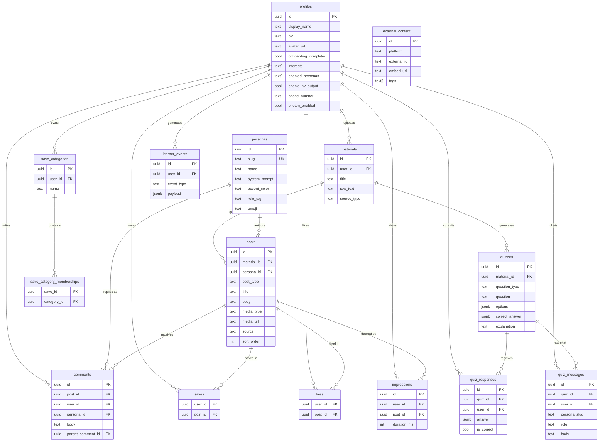

# Scrollabus

**Doomscroll your syllabus. Let the algorithm teach you.**

Scrollabus is a TikTok-style academic feed. Upload study material — a lecture PDF, notes, or a text paste — and it transforms that content into a personalized stream of short-form educational posts. Six AI study influencer personas each write in a distinct voice and style. Students comment, save, interact with posts, and take inline quizzes the same way they would on any creator platform. When a student comments, the persona replies in-character via AI. The feed adapts based on what each user uploads, saves, and engages with. A memory-native agent layer tracks long-term learning patterns and powers an ambient iMessage/SMS study companion.

---

## Features

- **Material-to-feed pipeline**: paste text, upload a PDF (with Gemini vision OCR), or link content — Scrollabus generates up to 30 short-form posts per upload across all active personas
- **Six AI study influencer personas**: Lecture Bestie, Exam Gremlin, Problem Grinder, Doodle Prof, Meme Lord, and Study Bard — each with a distinct system prompt, accent color, and teaching style
- **Multimodal posts**: each post can be text, image (AI-generated), audio (ElevenLabs TTS narration or Study Bard song), or video (Kling AI) depending on persona and user preferences
- **Interactive quizzes**: multiple-choice, multiple-response, and free-text quiz cards generated from user materials; auto-graded with AI-powered hint/explanation chat per question
- **Learner memory layer**: HydraDB stores long-term learner profiles, misconceptions, and study history; surfaced across quizzes, Photon nudges, and the teaching agent
- **Photon iMessage/SMS companion**: students opt in a phone number; Scrollabus sends proactive study nudges and handles inbound replies (quiz_me, explain_simpler, recap, general questions) via GMI Cloud and learner memory
- **Dify teaching agent**: a configurable Dify workflow orchestrates scheduled follow-ups, quiz delivery, and contextual re-explanation using GMI Cloud (DeepSeek/Llama)
- **Live AI comment replies**: commenting on a post triggers an n8n webhook that calls Featherless AI (DeepSeek-V3.2), which replies in the persona's voice and saves the response to Supabase
- **Direct messages**: users can DM any persona directly, powered by Gemini 2.0 Flash
- **Explore feed**: trending posts from other users' materials, ranked by an engagement score RPC (`get_trending_posts`)
- **Community tab**: surfaces users who share overlapping interests via `get_similar_users` RPC
- **External content ingestion**: n8n workflows scrape YouTube (every 6 hours via YouTube Data API v3) and TikTok (public oEmbed) into the `external_content` table
- **Creao integration**: a scheduled n8n workflow polls a Google Sheet for Creao-generated content every 15 minutes and inserts new posts
- **Save categories**: users organise saved posts into named collections
- **Persona-filtered feed**: filter any feed view by a specific persona slug
- **PWA manifest**: installable as a mobile web app
- **Row-level security**: all tables use Supabase RLS; service-role key is only used inside n8n and Next.js API routes

---

## Tech Stack

| Layer | Technology |
|---|---|
| Framework | Next.js 15 (App Router, TypeScript) |
| Database & auth | Supabase (Postgres + Auth + Storage) |
| AI — PDF parsing | Gemini 2.5 Flash (vision), `pdf-parse` (fallback) |
| AI — DM chat | Gemini 2.0 Flash |
| AI — comment replies | Featherless AI / DeepSeek-V3.2 (via n8n) |
| AI — post generation | Featherless AI / DeepSeek (via n8n sub-workflows) |
| AI — image generation | Gemini Imagen (via n8n) |
| AI — video generation | Kling AI (via n8n) |
| AI — TTS audio | ElevenLabs (Next.js `/api/tts`), Gemini TTS (via n8n) |
| AI — teaching agent | Dify workflow + GMI Cloud (DeepSeek/Llama) |
| AI — Anthropic | Claude SDK (available for persona/quiz routes) |
| Learner memory | HydraDB (`@hydra_db/node`) |
| Ambient companion | Photon (`@photon-ai/imessage-kit`) — iMessage/SMS study nudges |
| Automation | n8n (self-hosted, 6 workflows + 5 sub-workflows) |
| Scheduling & bridge | Creao → Google Sheets → n8n |
| Social ingestion | YouTube Data API v3, TikTok oEmbed |
| Styling | Tailwind CSS v3 |
| Animation | Framer Motion |
| Bottom sheets | Vaul |
| Deployment | Vercel (assumed) |

---

## Architecture

```mermaid
flowchart TD
    User["Browser / PWA"]
    SMS["Student iMessage/SMS"]

    subgraph Next["Next.js App (App Router)"]
        FeedAPI["/api/feed"]
        CommentsAPI["/api/comments"]
        MaterialsAPI["/api/materials"]
        ParsePDF["/api/materials/parse-pdf"]
        ExploreAPI["/api/explore"]
        CommunityAPI["/api/community"]
        DMAPI["/api/personas/:slug/dm"]
        PersonaAPI["/api/personas/:slug"]
        QuizAPI["/api/quizzes + /api/quiz-chat + /api/quiz-responses"]
        TTSAPI["/api/tts"]
        PhotonAPI["/api/photon/*"]
        PostAPI["/api/posts/:id"]
    end

    subgraph Supabase["Supabase"]
        Auth["Auth"]
        DB["Postgres"]
        Storage["Storage (post-media, avatars)"]
    end

    subgraph N8N["n8n Workflows"]
        W1["Workflow 1: Material → Posts (Orchestrator)"]
        W1a["1a: sub-text"]
        W1b["1b: sub-image"]
        W1c["1c: sub-audio-tts"]
        W1d["1d: sub-audio-bard"]
        W1e["1e: sub-video"]
        W2["Workflow 2: Comment → AI Reply"]
        W3["Workflow 3: Engagement Sync"]
        W4["Workflow 4: Creao Ingest (every 15 min)"]
        W5["Workflow 5: YouTube Fetch (every 6 h)"]
        W6["Workflow 6: TikTok Fetch"]
    end

    Gemini["Gemini (PDF parse, DM chat, Imagen, TTS)"]
    Featherless["Featherless AI (DeepSeek-V3.2)"]
    ElevenLabs["ElevenLabs (TTS)"]
    HydraDB["HydraDB (learner memory)"]
    Dify["Dify (teaching agent)"]
    GMI["GMI Cloud (DeepSeek/Llama)"]
    Photon["Photon (iMessage/SMS)"]
    Creao["Creao → Google Sheets"]
    YouTube["YouTube Data API v3"]
    TikTok["TikTok oEmbed"]
    Kling["Kling AI (video)"]

    User -->|"HTTPS"| Next
    SMS <-->|"iMessage/SMS"| Photon
    Photon <-->|"webhook"| PhotonAPI
    PhotonAPI --> HydraDB
    PhotonAPI --> Dify
    PhotonAPI --> GMI
    Dify --> GMI
    Next --> Auth
    Next --> DB
    Next --> Storage
    MaterialsAPI -->|"upload text/PDF"| ParsePDF
    ParsePDF -->|"vision OCR"| Gemini
    MaterialsAPI -->|"POST webhook"| W1
    CommentsAPI -->|"POST webhook"| W2
    DMAPI -->|"chat"| Gemini
    TTSAPI --> ElevenLabs
    QuizAPI --> DB
    QuizAPI --> GMI

    W1 --> W1a & W1b & W1c & W1d & W1e
    W1a & W1b & W1c & W1d & W1e --> Featherless
    W1b --> Gemini
    W1c --> Gemini
    W1d --> Gemini
    W1e --> Kling
    W1a & W1b & W1c & W1d & W1e -->|"INSERT posts"| DB

    W2 --> Featherless
    W2 -->|"INSERT comment"| DB

    W4 --> Creao
    W4 -->|"INSERT posts"| DB

    W5 --> YouTube
    W5 -->|"INSERT external_content"| DB

    W6 --> TikTok
    W6 -->|"INSERT external_content"| DB
```



---

## Data Model



---

## n8n Workflow Map

| File | Trigger | Purpose |
|---|---|---|
| `workflow-1-material-to-posts.json` | Webhook (POST) | Orchestrator: chunks text, fetches personas, builds prompts, fires 5 sub-workflows in parallel |
| `workflow-1a-sub-text.json` | Called by W1 | Calls Featherless, saves text post to Supabase |
| `workflow-1b-sub-image.json` | Called by W1 | Calls Featherless for text, Gemini Imagen for image, uploads to Storage, saves post |
| `workflow-1c-sub-audio-tts.json` | Called by W1 | Calls Featherless for text, Gemini TTS for narration, saves audio post |
| `workflow-1d-sub-audio-bard.json` | Called by W1 | Calls Featherless to write song lyrics, Gemini TTS for audio, saves audio post |
| `workflow-1e-sub-video.json` | Called by W1 | Calls Featherless for script, Kling AI for video generation, saves video post |
| `workflow-2-comment-reply.json` | Webhook (POST) | Fetches post + persona, calls Featherless (DeepSeek-V3.2), inserts AI reply comment |
| `workflow-3-engagement-sync.json` | Scheduled | Syncs engagement data to Google Sheets for Creao |
| `workflow-4-creao-ingest.json` | Every 15 min | Polls Google Sheet for new Creao output, inserts as `review` posts |
| `workflow-5-youtube-fetch.json` | Every 6 hours | Fetches recent videos from curated YouTube channels via Data API v3 |
| `workflow-6-tiktok-fetch.json` | Scheduled | Fetches TikTok embeds via public oEmbed endpoint |
| `dify-teaching-workflow.yml` | Dify import | Teaching agent: scheduled follow-ups, quiz delivery, contextual re-explanation |
| `dify-video-workflow.yml` | Dify import | Video content generation workflow |

---

## Quickstart

### Prerequisites

- Node.js 20+
- A Supabase project (free tier works)
- A self-hosted or cloud n8n instance
- API keys: Gemini (required), Featherless (required in n8n), ElevenLabs (required for in-app TTS), YouTube Data API v3 (optional, for Workflow 5)
- Optional: HydraDB, Dify, GMI Cloud, Photon accounts for the memory/companion layer

### 1. Clone and install

```bash
git clone <repo-url>
cd scrollabus
npm install
```

### 2. Configure environment

```bash
cp .env.example .env.local
```

Open `.env.local` and fill in:

```
# Required
NEXT_PUBLIC_SUPABASE_URL=https://your-project.supabase.co
NEXT_PUBLIC_SUPABASE_ANON_KEY=your-anon-key
SUPABASE_SERVICE_KEY=your-service-role-key

GEMINI_API_KEY=your-gemini-api-key
ELEVENLABS_API_KEY=your-elevenlabs-api-key

N8N_WEBHOOK_MATERIAL_TO_POST=http://localhost:5678/webhook/scrollabus-material-to-posts
N8N_WEBHOOK_COMMENT_REPLY=http://localhost:5678/webhook/scrollabus-comment-reply

# Optional — memory & companion layer
HYDRADB_API_KEY=your-hydradb-api-key
HYDRADB_TENANT_ID=scrollabus
DIFY_API_URL=https://api.dify.ai/v1
DIFY_API_KEY=your-dify-workflow-api-key
GMI_CLOUD_API_KEY=your-gmi-cloud-api-key
PHOTON_API_KEY=your-photon-api-key
```

### 3. Set up Supabase

Run these in the Supabase SQL editor in order:

```bash
# 1. Base schema
supabase/schema.sql

# 2. Migrations (run each in order)
supabase/migrations/add_onboarding_completed.sql
supabase/migrations/add_profile_fields.sql
supabase/migrations/add_media_columns_to_posts.sql
supabase/migrations/add_media_and_persona_prefs.sql
supabase/migrations/add_av_output_pref.sql
supabase/migrations/add_likes_and_save_categories.sql
supabase/migrations/add_external_content.sql
supabase/migrations/create_post_media_bucket.sql
supabase/migrations/add_quizzes.sql
supabase/migrations/add_learner_memory.sql
supabase/migrations/add_phone_number.sql

# 3. RPC functions
supabase/engagement-rpc.sql
supabase/community-rpc.sql
supabase/external-content-rpc.sql

# 4. Seed personas
supabase/seed.sql
```

### 4. Import n8n workflows

1. In your n8n instance, import all JSON files from `n8n/` using **Workflows → Import from file**.
2. Import `workflow-1-material-to-posts.json` last, then open it and replace the placeholder workflow IDs in the five Execute nodes with the actual IDs assigned to `workflow-1a` through `workflow-1e` by your n8n instance.
3. Add the following environment variables inside n8n (**Settings → Variables**):
   - `SUPABASE_URL`
   - `SUPABASE_SERVICE_KEY`
   - `FEATHERLESS_API_KEY`
   - `YOUTUBE_API_KEY` (optional)
   - `GOOGLE_SHEET_ID` (optional, for Creao workflows)
4. Activate all workflows.
5. Copy the webhook URLs for Workflows 1 and 2 into your `.env.local`.

### 5. (Optional) Set up Dify teaching workflows

1. In Dify, import `n8n/dify-teaching-workflow.yml` and `n8n/dify-video-workflow.yml`.
2. Configure a GMI Cloud connection in Dify (API base: `https://api.gmi-serving.com/v1`).
3. Copy the Dify API key into `.env.local` as `DIFY_API_KEY`.

### 6. Run the dev server

```bash
npm run dev
```

Open [http://localhost:3000](http://localhost:3000). Sign up, complete onboarding, upload study material, and your first feed will generate.

---

## App Routes

| Route | Description |
|---|---|
| `/` | Landing / redirect to login or feed |
| `/login` | Supabase email auth |
| `/onboarding` | Set display name, interests, enabled personas, AV preference |
| `/feed` | Main personalized feed, paginated with per-material cursor |
| `/explore` | Trending posts from all users, interest-filtered |
| `/community` | Users with overlapping interests |
| `/saved` | Saved posts organized by category |
| `/upload` | Upload material (PDF, text paste) and trigger generation |
| `/profile` | Profile view and settings |

---

## API Routes

| Method | Path | Description |
|---|---|---|
| `GET` | `/api/feed` | Paginated feed with exponential-decay slot allocation across materials |
| `GET/POST` | `/api/comments` | Fetch or post a comment; posting fires the n8n comment-reply webhook |
| `GET/POST` | `/api/materials` | List or create study materials |
| `POST` | `/api/materials/parse-pdf` | Parse PDF via Gemini vision (primary) or `pdf-parse` (fallback) |
| `DELETE` | `/api/materials/[id]` | Delete a material and its posts |
| `GET` | `/api/posts/[id]` | Fetch a single post by ID |
| `GET` | `/api/personas/[slug]` | Fetch a single persona by slug |
| `POST` | `/api/personas/[slug]/dm` | Send a DM to a persona (Gemini 2.0 Flash, stateful chat) |
| `GET` | `/api/explore` | Trending posts via `get_trending_posts` RPC |
| `GET` | `/api/explore/external` | External content (YouTube / TikTok) |
| `GET` | `/api/community` | Similar users via `get_similar_users` RPC |
| `GET/POST` | `/api/saves` | Save or unsave a post |
| `GET/POST` | `/api/saved-posts` | Saved posts with optional category filter |
| `POST` | `/api/saved-posts/memberships` | Assign a saved post to categories |
| `GET/POST` | `/api/save-categories` | List or create save categories |
| `GET/POST` | `/api/likes` | Like or unlike a post |
| `GET` | `/api/likes/posts` | Fetch liked posts |
| `POST` | `/api/impressions` | Record a feed view impression |
| `GET/PATCH` | `/api/profile` | Fetch or update profile |
| `POST` | `/api/profile/avatar` | Upload profile avatar to Supabase Storage |
| `POST` | `/api/profile/interests` | Update user interests |
| `GET` | `/api/quizzes` | List quizzes for a material |
| `POST` | `/api/quizzes/generate` | Generate quizzes from a material via GMI Cloud |
| `GET/POST` | `/api/quiz-responses` | Fetch or submit a quiz response (auto-graded for MCQ) |
| `GET/POST` | `/api/quiz-chat` | Fetch or send a message in a quiz's hint/explanation chat |
| `POST` | `/api/tts` | Text-to-speech via ElevenLabs |
| `POST` | `/api/photon/connect` | Register a phone number for the Photon SMS companion |
| `POST` | `/api/photon/webhook` | Inbound iMessage/SMS handler (quiz_me, explain_simpler, recap, etc.) |
| `GET` | `/api/photon/cron` | Scheduled outbound study nudge dispatcher |
| `GET` | `/api/auth/callback` | Supabase OAuth callback handler |

---

## AI Personas

| Slug | Name | Style | Post types | Media |
|---|---|---|---|---|
| `lecture-bestie` | Lecture Bestie | Casual, friendly plain English | concept, recap | text, audio |
| `exam-gremlin` | Exam Gremlin | Mischievous, trap-focused | trap | text |
| `problem-grinder` | Problem Grinder | Methodical, step-by-step | example | text |
| `doodle-prof` | Doodle Prof | 3-panel comic strip (JSON output) | concept | image |
| `meme-lord` | Meme Lord | Classic meme templates (JSON output) | concept | image |
| `study-bard` | Study Bard | Song lyrics with hook/verse/chorus (JSON output) | recap | audio |

`doodle-prof`, `meme-lord`, and `study-bard` return structured JSON from the LLM. The sub-workflows parse this into rendered images or audio before saving to Supabase Storage.

---

## Feed Algorithm

The home feed uses **exponential-decay slot allocation** across the user's most recent five materials (newest → most posts), followed by **round-robin interleaving** across material buckets so content from different uploads alternates in the scroll. Pagination uses a per-material cursor map (`{ [materialId]: lastSeenCreatedAt | null }`) serialized as a JSON string.

Decay constant: `0.6` (each older material gets 60% of the slots of the one above it).

Page size: `10` posts per page (`FEED_PAGE_SIZE`).

---

## Learner Memory & Companion Layer

Three services work together to provide persistent, personalized learning:

**HydraDB** stores structured learner memories — topics studied, misconceptions identified, quiz performance, and engagement patterns. Memories are written on quiz submissions, Photon inbound replies, and material interactions; recalled as context for quiz hints, Photon responses, and Dify agent runs.

**Dify teaching workflow** (`dify-teaching-workflow.yml`) is a configurable agent graph built in the Dify UI. It receives trigger events (scheduled follow-up, quiz request, material upload) and decides what to send back — a nudge message, a quiz question, or a re-explanation — using GMI Cloud for inference.

**Photon** handles ambient iMessage/SMS delivery. Students opt in a phone number on their profile. Scrollabus sends proactive nudges; inbound replies are routed to `/api/photon/webhook` where intent classification dispatches to the appropriate handler (quiz, recap, simpler explanation, or general GMI chat with memory context).

---

## Environment Variables

| Variable | Required | Used by | Notes |
|---|---|---|---|
| `NEXT_PUBLIC_SUPABASE_URL` | Yes | Next.js | Public Supabase project URL |
| `NEXT_PUBLIC_SUPABASE_ANON_KEY` | Yes | Next.js | Public anon key for client-side auth |
| `SUPABASE_SERVICE_KEY` | Yes | Next.js API routes | Service-role key; never expose to browser |
| `GEMINI_API_KEY` | Yes | Next.js | PDF vision parse + DM chat |
| `ELEVENLABS_API_KEY` | Yes | Next.js `/api/tts` | In-app text-to-speech |
| `N8N_WEBHOOK_MATERIAL_TO_POST` | Yes | Next.js | Webhook URL for Workflow 1 |
| `N8N_WEBHOOK_COMMENT_REPLY` | Yes | Next.js | Webhook URL for Workflow 2 |
| `HYDRADB_API_KEY` | No | Next.js | Learner memory layer; omit to disable |
| `HYDRADB_TENANT_ID` | No | Next.js | Defaults to `scrollabus` |
| `DIFY_API_URL` | No | Next.js | Dify teaching agent base URL |
| `DIFY_API_KEY` | No | Next.js | Dify workflow API key |
| `GMI_CLOUD_API_KEY` | No | Next.js | DeepSeek/Llama via GMI for quizzes and Photon responses |
| `PHOTON_API_KEY` | No | Next.js | Photon iMessage/SMS companion |
| `FEATHERLESS_API_KEY` | Yes | n8n only | Set as n8n variable, not in `.env.local` |
| `SUPABASE_URL` | Yes | n8n only | Set as n8n variable (same value as public URL) |
| `SUPABASE_SERVICE_KEY` | Yes | n8n only | Set as n8n variable |
| `YOUTUBE_API_KEY` | No | n8n Workflow 5 | YouTube Data API v3; omit to disable ingestion |
| `GOOGLE_SHEET_ID` | No | n8n Workflows 3 & 4 | Sheet ID for Creao bridge |

---

## Troubleshooting

**Feed is empty after uploading material**
- Check that Workflow 1 is active in n8n and the webhook URL in `.env.local` matches exactly.
- Open n8n → Executions to see if the workflow ran and inspect any errors.
- If `waitForSubWorkflow: false` is set, posts appear asynchronously — wait a few seconds and refresh.

**PDF parse returns empty or truncated text**
- Gemini vision requires `GEMINI_API_KEY`. Without it, the fallback is `pdf-parse` which cannot read scanned or image-only PDFs.
- PDFs larger than 10 MB are rejected.

**Comments get no AI reply**
- Verify `N8N_WEBHOOK_COMMENT_REPLY` is set and Workflow 2 is active.
- Check that `FEATHERLESS_API_KEY` is set as an n8n variable (not in `.env.local`).
- Replies are fire-and-forget; errors are logged server-side but do not surface to the user.

**n8n workflow IDs are wrong in Workflow 1**
- After importing all workflows, open Workflow 1, click each Execute node, and replace the placeholder `workflowId` values with the numeric IDs shown in your n8n workflow list.

**`PGRST200` "relationship not found" errors in feed**
- This is a PostgREST schema cache issue when concurrent requests share a join. The feed route resolves likes in a single follow-up query to avoid this. If it still occurs, manually reload the Supabase schema cache under **Settings → API → Reload schema**.

**Supabase RLS blocks posts from n8n**
- n8n uses the service-role key, which bypasses RLS. If you see 403s from n8n, confirm the `Authorization: Bearer <service-key>` header is set in each HTTP node.

**Photon webhook receives no inbound messages**
- Verify `PHOTON_API_KEY` is set and the webhook URL in Photon's dashboard points to `/api/photon/webhook`.
- Confirm the student has opted in (`photon_enabled = true`) and their phone number matches the profile record.

**Quizzes not generating**
- `GMI_CLOUD_API_KEY` is required for quiz generation via `/api/quizzes/generate`.
- Ensure the material `raw_text` is not empty; quiz generation reads from the material text.

---

## Project Structure

```
scrollabus/
├── app/
│   ├── (app)/              # Authenticated routes (feed, explore, community, saved, upload, profile)
│   ├── (auth)/             # Login
│   ├── (onboarding)/       # Onboarding flow
│   ├── api/                # Next.js API routes
│   │   ├── comments/
│   │   ├── community/
│   │   ├── explore/
│   │   ├── feed/
│   │   ├── impressions/
│   │   ├── likes/
│   │   ├── materials/
│   │   ├── personas/[slug]/
│   │   ├── photon/         # Photon connect / webhook / cron
│   │   ├── posts/[id]/
│   │   ├── profile/
│   │   ├── quiz-chat/
│   │   ├── quiz-responses/
│   │   ├── quizzes/
│   │   ├── save-categories/
│   │   ├── saved-posts/
│   │   ├── saves/
│   │   └── tts/
│   ├── globals.css
│   ├── layout.tsx
│   └── manifest.ts         # PWA manifest
├── components/             # React UI components (feed, explore, quiz, social, onboarding)
├── lib/
│   ├── constants.ts        # Persona config, feed constants, post type display config
│   ├── dify.ts             # Dify teaching agent helpers
│   ├── gmi.ts              # GMI Cloud (OpenAI-compatible) client
│   ├── hydra.ts            # HydraDB learner memory helpers
│   ├── n8n.ts              # Webhook trigger helpers
│   ├── personas.ts         # Static persona definitions (mirrored in DB)
│   ├── photon.ts           # Photon iMessage/SMS client
│   ├── types.ts            # TypeScript interfaces and union types
│   └── supabase/           # Supabase client factories (client, server, service, middleware)
├── n8n/                    # n8n workflow JSON files + Dify workflow YAML exports
├── supabase/
│   ├── schema.sql          # Base schema (run first)
│   ├── seed.sql            # Persona seed data
│   ├── migrations/         # Incremental schema additions
│   ├── engagement-rpc.sql  # get_trending_posts RPC
│   ├── community-rpc.sql   # get_similar_users RPC
│   └── external-content-rpc.sql
├── types/                  # TypeScript declaration files (e.g. pdf-parse.d.ts)
├── middleware.ts            # Supabase session refresh on every request
├── .env.example
└── README.md
```
