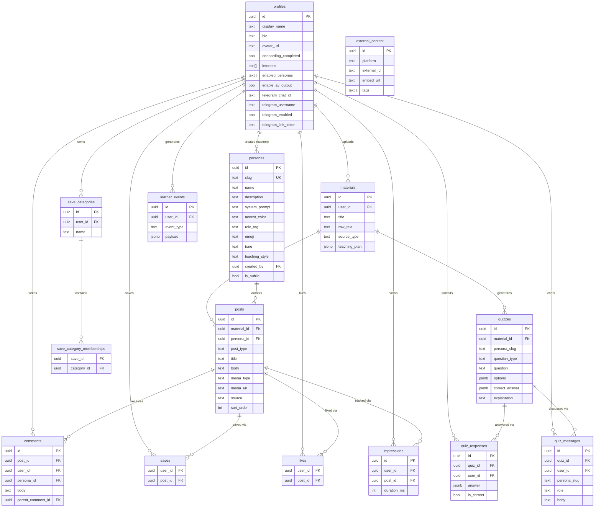

# Scrollabus

**Doomscroll your syllabus. Let the algorithm teach you.**

Scrollabus is a TikTok-style academic feed. Upload study material — a lecture PDF, notes, or a text paste — and it transforms that content into a personalized stream of short-form educational posts. Six built-in AI study influencer personas each write in a distinct voice and style; users can also create their own custom personas. Students comment, save, interact with posts, and take inline quizzes the same way they would on any creator platform. When a student comments, the persona replies in-character via AI. The feed adapts based on what each user uploads, saves, and engages with. A memory-native agent layer tracks long-term learning patterns and powers an ambient Telegram study companion.

---

## Features

- **Material-to-feed pipeline**: paste text, upload a PDF (with Gemini vision OCR), or link content — Scrollabus generates up to 30 short-form posts per upload across all active personas
- **Six built-in AI study influencer personas**: Lecture Bestie, Exam Gremlin, Problem Grinder, Doodle Prof, Meme Lord, and Study Bard — each with a distinct system prompt, accent color, and teaching style
- **Custom persona creation**: users can author their own study personas (name, emoji, accent color, tone, teaching style, system prompt), make them public, and use them for post and quiz generation
- **Multimodal posts**: each post can be text, image (AI-generated), audio (ElevenLabs TTS narration or Study Bard song), or slideshow (3 Imagen 4 Fast frames + Gemini TTS voiceover, auto-advancing with crossfade) depending on persona and user preferences
- **Interactive quizzes**: multiple-choice, multiple-response, and free-text quiz cards generated from user materials via Gemini 2.5 Flash; each question is voiced in the generating persona's style; auto-graded with AI-powered hint/explanation chat per question (also Gemini 2.5 Flash, Socratic guardrails before answer, full explanation after)
- **Adaptive feed**: `?mode=adaptive` biases the feed toward personas the student engages with most, scored by a `get_persona_affinity` RPC (likes +3, saves +3, dwell ≥ 2 s +1, comments +2)
- **Dify teaching plan**: on every material upload, a Dify workflow analyzes the content and produces a pedagogical plan (`priority_personas`, `emphasis`, `first_review_concept`, `quiz_topic`); this plan is stored in `materials.teaching_plan` and passed to n8n to enrich content generation
- **Reactive content loop** (Workflow 7): a scheduled n8n job reads quiz failure hotspots and engagement data, then generates targeted remedial posts (`source = 'reactive'`) via Featherless AI
- **Persona pulse** (Workflow 8): a scheduled n8n job generates community update posts (`post_type = 'pulse'`) in each persona's voice based on aggregate engagement trends
- **Learner memory layer**: HydraDB stores long-term learner profiles, misconceptions, and study history; surfaced across quizzes, Telegram nudges, and the teaching agent
- **Telegram study companion**: students link their Telegram account via a bot deep link; Scrollabus sends proactive study nudges and handles inbound replies (quiz_me, explain_simpler, recap, general questions) via GMI Cloud and learner memory
- **Dify teaching agent**: a configurable Dify workflow orchestrates scheduled follow-ups, quiz delivery, and contextual re-explanation using GMI Cloud (DeepSeek/Llama)
- **Live AI comment replies**: commenting on a post triggers an n8n webhook that calls Featherless AI (DeepSeek-V3.2), which replies in the persona's voice and saves the response to Supabase
- **Direct messages**: users can DM any persona directly, powered by Gemini 2.0 Flash
- **Explore feed**: trending posts from other users' materials, ranked by an engagement score RPC (`get_trending_posts`); includes live YouTube search via YouTube Data API v3
- **Community tab**: surfaces users who share overlapping interests via `get_similar_users` RPC
- **External content ingestion**: n8n workflows scrape YouTube (every 6 hours via YouTube Data API v3) and TikTok (public oEmbed) into the `external_content` table
- **Creao integration**: a scheduled n8n workflow polls a Google Sheet for Creao-generated content every 15 minutes and inserts new posts
- **Save categories**: users organise saved posts into named collections
- **Persona-filtered feed**: filter any feed view by a specific persona slug
- **PWA manifest**: installable as a mobile web app
- **Row-level security**: all tables use Supabase RLS; service-role key is only used inside n8n and Next.js API routes

---

## Tech Stack

| Layer | Technology |
|---|---|
| Framework | Next.js 15 (App Router, TypeScript) |
| Database & auth | Supabase (Postgres + Auth + Storage) |
| AI — PDF parsing | Gemini 2.5 Flash (vision), `pdf-parse` (fallback) |
| AI — DM chat | Gemini 2.0 Flash |
| AI — comment replies | Featherless AI / DeepSeek-V3.2 (via n8n) |
| AI — post generation | Featherless AI / DeepSeek (via n8n) |
| AI — quiz generation | Gemini 2.5 Flash (`lib/quizzes.ts`) |
| AI — quiz chat | Gemini 2.5 Flash |
| AI — image generation | Gemini Imagen (via n8n) |
| AI — slideshow video | Imagen 4 Fast (frames) + Gemini TTS (voiceover) via n8n |
| AI — video generation | Kling (via n8n, set `KLING_API_KEY` inside n8n) |
| AI — TTS audio | ElevenLabs (Next.js `/api/tts`), Gemini TTS (via n8n) |
| AI — teaching agent | Dify workflow + GMI Cloud (DeepSeek/Llama) |
| AI — Anthropic | Claude SDK (available, not wired to a specific route by default) |
| Learner memory | HydraDB (`@hydra_db/node`) |
| Ambient companion | Telegram Bot API — study nudges via Telegram |
| Automation | n8n (self-hosted, 8 workflows + 5 sub-workflows) |
| Scheduling & bridge | Creao → Google Sheets → n8n |
| Social ingestion | YouTube Data API v3, TikTok oEmbed |
| Styling | Tailwind CSS v3 |
| Animation | Framer Motion |
| Bottom sheets | Vaul |
| Deployment | Vercel (assumed) |

---

## Architecture

```mermaid
flowchart TD
    User["Browser / PWA"]
    TG["Student Telegram"]

    subgraph Next["Next.js App (App Router)"]
        FeedAPI["/api/feed"]
        CommentsAPI["/api/comments"]
        MaterialsAPI["/api/materials"]
        ParsePDF["/api/materials/parse-pdf"]
        ExploreAPI["/api/explore"]
        CommunityAPI["/api/community"]
        DMAPI["/api/personas/:slug/dm"]
        PersonaAPI["/api/personas/:slug"]
        PersonasAPI["/api/personas"]
        QuizAPI["/api/quizzes + /api/quiz-chat + /api/quiz-responses"]
        TTSAPI["/api/tts"]
        TelegramAPI["/api/telegram/*"]
        PostAPI["/api/posts/:id"]
    end

    subgraph Supabase["Supabase"]
        Auth["Auth"]
        DB["Postgres"]
        Storage["Storage (post-media, avatars)"]
        AffinityRPC["get_persona_affinity RPC"]
        TrendingRPC["get_trending_posts RPC"]
        SimilarRPC["get_similar_users RPC"]
    end

    subgraph N8N["n8n Workflows"]
        W1["Workflow 1: Material → Posts (Orchestrator)"]
        W1a["1a: sub-text"]
        W1b["1b: sub-image"]
        W1c["1c: sub-audio-tts"]
        W1d["1d: sub-audio-bard"]
        W1e["1e: sub-video"]
        W2["Workflow 2: Comment → AI Reply"]
        W3["Workflow 3: Engagement Sync"]
        W4["Workflow 4: Creao Ingest (every 15 min)"]
        W5["Workflow 5: YouTube Fetch (every 6 h)"]
        W6["Workflow 6: TikTok Fetch"]
        W7["Workflow 7: Reactive Content (scheduled)"]
        W8["Workflow 8: Persona Pulse (scheduled)"]
    end

    Gemini["Gemini (PDF parse, quiz gen, quiz chat, DM chat, Imagen, TTS)"]
    Featherless["Featherless AI (DeepSeek-V3.2)"]
    Kling["Kling (video generation via n8n)"]
    ElevenLabs["ElevenLabs (TTS)"]
    HydraDB["HydraDB (learner memory)"]
    Dify["Dify (teaching agent)"]
    GMI["GMI Cloud (DeepSeek/Llama)"]
    TelegramBot["Telegram Bot API"]
    Creao["Creao → Google Sheets"]
    YouTube["YouTube Data API v3"]
    TikTok["TikTok oEmbed"]

    User -->|"HTTPS"| Next
    TG <-->|"Telegram"| TelegramBot
    TelegramBot <-->|"webhook"| TelegramAPI
    TelegramAPI --> HydraDB
    TelegramAPI --> Dify
    TelegramAPI --> GMI
    Dify --> GMI
    Next --> Auth
    Next --> DB
    Next --> Storage
    FeedAPI --> AffinityRPC
    ExploreAPI --> TrendingRPC
    CommunityAPI --> SimilarRPC
    MaterialsAPI -->|"upload text/PDF"| ParsePDF
    ParsePDF -->|"vision OCR"| Gemini
    MaterialsAPI -->|"Dify teaching plan (10 s timeout)"| Dify
    MaterialsAPI -->|"POST webhook (with teaching plan)"| W1
    CommentsAPI -->|"POST webhook"| W2
    DMAPI -->|"chat"| Gemini
    TTSAPI --> ElevenLabs
    QuizAPI --> Gemini
    QuizAPI --> DB

    W1 --> W1a & W1b & W1c & W1d & W1e
    W1a & W1b & W1c & W1d & W1e --> Featherless
    W1b --> Gemini
    W1c --> Gemini
    W1d --> Gemini
    W1e --> Kling
    W1a & W1b & W1c & W1d & W1e -->|"INSERT posts"| DB

    W2 --> Featherless
    W2 -->|"INSERT comment"| DB

    W4 --> Creao
    W4 -->|"INSERT posts"| DB

    W5 --> YouTube
    W5 -->|"INSERT external_content"| DB

    W6 --> TikTok
    W6 -->|"INSERT external_content"| DB

    W7 -->|"quiz failure hotspots"| DB
    W7 --> Featherless
    W7 -->|"INSERT reactive posts"| DB

    W8 -->|"engagement summary"| DB
    W8 --> Featherless
    W8 -->|"INSERT pulse posts"| DB
```



---

## Data Model



---

## Quickstart

### 1. Prerequisites

- Node.js 20+
- A [Supabase](https://supabase.com) project
- A self-hosted or cloud [n8n](https://n8n.io) instance
- API keys for the services you want to enable (see Environment Variables)

### 2. Clone and install

```bash
git clone <repo-url> scrollabus
cd scrollabus
npm install
```

### 3. Configure environment

```bash
cp .env.example .env.local
# Fill in the required values in .env.local
```

### 4. Set up Supabase

Run these SQL files against your Supabase project in order:

```bash
# 1. Base schema
supabase db push --file supabase/schema.sql

# 2. Seed personas
supabase db push --file supabase/seed.sql

# 3. Incremental migrations (run each in supabase/migrations/ in filename order)

# 4. RPCs
supabase db push --file supabase/engagement-rpc.sql
supabase db push --file supabase/community-rpc.sql
supabase db push --file supabase/external-content-rpc.sql
supabase db push --file supabase/persona-affinity-rpc.sql
```

### 5. Import n8n workflows

1. In n8n, import all JSON files from `n8n/` (Workflows 1–8 and sub-workflows 1a–1e).
2. After importing, open Workflow 1 and replace the placeholder `workflowId` values in each Execute Workflow node with the actual IDs assigned by your n8n instance.
3. Set these environment variables inside n8n (not in `.env.local`):
   - `FEATHERLESS_API_KEY`
   - `SUPABASE_URL`
   - `SUPABASE_SERVICE_KEY`
   - `KLING_API_KEY` (for video generation, Workflow 1e)
   - `YOUTUBE_API_KEY` (for Workflow 5)
   - `GOOGLE_SHEET_ID` (for Workflows 3 & 4)
4. Activate all workflows.

### 6. Run

```bash
npm run dev
# App runs on http://localhost:3000
```

---

## How It Works

### Material Upload Flow

```
POST /api/materials
  │
  ├─ INSERT material row (Supabase)
  │
  ├─ writeMemory (HydraDB, fire-and-forget)
  │
  ├─ generateAndSaveQuizzes (Gemini 2.5 Flash, fire-and-forget)
  │   └─ persona-voiced quizzes → INSERT quizzes (Supabase)
  │
  └─ async pipeline:
      ├─ triggerTeachingWorkflow (Dify, 10 s timeout)
      │   └─ returns { emphasis, priority_personas, … }
      │   └─ UPDATE materials.teaching_plan (Supabase)
      │
      └─ triggerMaterialToPost (n8n Webhook, enriched with Dify output)
          └─ Workflow 1 (Orchestrator)
              ├─ 1a: text posts    → Featherless AI → INSERT posts
              ├─ 1b: image posts   → Featherless AI + Imagen → INSERT posts
              ├─ 1c: audio TTS     → Featherless AI + Gemini TTS → INSERT posts
              ├─ 1d: audio bard    → Featherless AI + Gemini TTS → INSERT posts
              └─ 1e: video/slideshow → Kling + Imagen 4 Fast → INSERT posts
```

### Comment Reply Flow

```
POST /api/comments  →  INSERT comment (Supabase)
                    →  POST n8n webhook (fire-and-forget)
                           └─ Workflow 2: calls Featherless AI (DeepSeek-V3.2)
                                         → INSERT AI reply comment (Supabase)
```

### Quiz Generation

`lib/quizzes.ts` generates quizzes using Gemini 2.5 Flash with per-persona prompting strategies. Each enabled persona generates `QUIZZES_PER_MATERIAL / persona_count` questions (minimum 1), all in parallel. Results are bulk-inserted into the `quizzes` table with a `persona_slug` column.

Default: `QUIZZES_PER_MATERIAL = 3`.

### Feed Algorithm

The home feed uses **exponential-decay slot allocation** across the user's most recent five materials (newest → most posts), followed by **round-robin interleaving** across material buckets so content from different uploads alternates in the scroll.

- Decay constant: `0.6` (each older material gets 60% of the slots of the one above it)
- Page size: `10` posts (`FEED_PAGE_SIZE`)
- Pagination: per-material cursor map `{ [materialId]: lastSeenCreatedAt | null }` serialized as a JSON string

**Adaptive mode** (`?mode=adaptive`): fetches `get_persona_affinity` scores for the user and reranks posts within each material bucket toward higher-affinity personas. Scoring weights: likes +3, saves +3, dwell ≥ 2000 ms +1, human comments +2.

On fresh feed load (no cursor), the feed route recalls weak/stale learner memories from HydraDB and fires a `feed_opened` event to the Dify teaching workflow.

### Scheduled n8n Workflows

| Workflow | Trigger | What it does |
|---|---|---|
| 4 — Creao Ingest | every 15 min | Polls Google Sheet for Creao posts, inserts into `posts` |
| 5 — YouTube Fetch | every 6 h | Fetches channel videos via YouTube Data API v3, inserts into `external_content` |
| 6 — TikTok Fetch | schedule | Fetches via public oEmbed, inserts into `external_content` |
| 7 — Reactive Content | schedule | Reads quiz failure hotspots + engagement data, generates remedial `reactive` posts via Featherless AI |
| 8 — Persona Pulse | schedule | Reads engagement summaries, generates community `pulse` posts in each persona's voice via Featherless AI |

---

## API Routes

| Method | Route | Description |
|---|---|---|
| `GET` | `/api/feed` | Paginated home feed (cursor-based); supports `?material_id`, `?persona_slug`, `?mode=adaptive` |
| `GET/POST` | `/api/comments` | List or create a comment; POST triggers n8n Workflow 2 webhook for AI reply |
| `POST` | `/api/materials` | Upload study material; triggers quiz generation (Gemini 2.5 Flash), Dify teaching plan, and n8n Workflow 1 |
| `DELETE` | `/api/materials/[id]` | Delete a material and its posts |
| `POST` | `/api/materials/parse-pdf` | Parse a PDF upload: Gemini 2.5 Flash vision (primary) or `pdf-parse` (fallback) |
| `GET` | `/api/posts/[id]` | Fetch a single post by ID |
| `GET/POST` | `/api/personas` | List all visible personas; POST creates a custom persona (authenticated user) |
| `GET/PATCH/DELETE` | `/api/personas/[slug]` | Fetch persona + recent posts; PATCH updates a custom persona (owner only); DELETE removes it |
| `POST` | `/api/personas/[slug]/dm` | Send a DM to a persona (Gemini 2.0 Flash, stateful chat) |
| `GET` | `/api/explore` | Trending posts via `get_trending_posts` RPC |
| `GET` | `/api/explore/external` | External content (YouTube / TikTok) |
| `GET` | `/api/explore/search` | Live YouTube search via YouTube Data API v3 |
| `GET` | `/api/community` | Similar users via `get_similar_users` RPC |
| `GET/POST` | `/api/saves` | Save or unsave a post |
| `GET/POST` | `/api/saved-posts` | Saved posts with optional category filter |
| `POST` | `/api/saved-posts/memberships` | Assign a saved post to categories |
| `GET/POST` | `/api/save-categories` | List or create save categories |
| `GET/POST` | `/api/likes` | Like or unlike a post |
| `GET` | `/api/likes/posts` | Fetch liked posts |
| `POST` | `/api/impressions` | Record a feed view impression |
| `GET/PATCH` | `/api/profile` | Fetch or update profile |
| `POST` | `/api/profile/avatar` | Upload profile avatar to Supabase Storage |
| `POST` | `/api/profile/interests` | Update user interests |
| `GET` | `/api/quizzes` | List quizzes for a material |
| `POST` | `/api/quizzes/generate` | Generate persona-voiced quizzes from a material (Gemini 2.5 Flash) |
| `GET/POST` | `/api/quiz-responses` | Fetch or submit a quiz response (auto-graded for MCQ/multiple-response) |
| `GET/POST` | `/api/quiz-chat` | Fetch or send a message in a quiz's hint/explanation chat (Gemini 2.5 Flash) |
| `POST` | `/api/tts` | Text-to-speech via ElevenLabs |
| `GET/POST` | `/api/telegram/connect` | Link Telegram account and toggle study companion |
| `POST` | `/api/telegram/webhook` | Inbound Telegram message handler (quiz_me, explain_simpler, recap, etc.) |
| `GET` | `/api/telegram/cron` | Scheduled outbound study nudge dispatcher via Telegram |
| `POST` | `/api/telegram/setup-webhook` | One-time Telegram webhook registration |
| `GET` | `/api/auth/callback` | Supabase OAuth callback handler |

---

## AI Personas

### Built-in personas

| Slug | Name | Style | Post types | Media |
|---|---|---|---|---|
| `lecture-bestie` | Lecture Bestie | Casual, friendly plain English | concept, recap | text, audio |
| `exam-gremlin` | Exam Gremlin | Mischievous, trap-focused | trap | text |
| `problem-grinder` | Problem Grinder | Methodical, step-by-step | example | text |
| `doodle-prof` | Doodle Prof | 3-panel comic strip (JSON output) | concept | image |
| `meme-lord` | Meme Lord | Classic meme templates (JSON output) | concept | image |
| `study-bard` | Study Bard | Song lyrics with hook/verse/chorus (JSON output) | recap | audio |

`doodle-prof`, `meme-lord`, and `study-bard` return structured JSON from the LLM. The sub-workflows parse this into rendered images or audio before saving to Supabase Storage.

### Custom personas

Authenticated users can create their own personas via `POST /api/personas`. Required fields: `name`, `slug`, `role_tag`, `tone`, `teaching_style`, `description`. Optional: `emoji`, `accent_color`, `is_public`. The system prompt is auto-generated from `name + role_tag + tone + teaching_style + description`. Custom personas can be used for post generation (by including the slug in `enabled_personas`) and appear in DMs and quiz chat like built-in ones. RLS allows: owner full CRUD, public custom personas visible to all authenticated users, private personas visible only to their owner.

---

## Post Types and Sources

| `post_type` | Description |
|---|---|
| `concept` | Core concept explanation |
| `example` | Worked example or practice problem |
| `trap` | Common exam mistake or trick |
| `review` | Spaced-repetition review card |
| `recap` | Summary or overview |
| `pulse` | Persona community update (from Workflow 8) |

| `source` | Origin |
|---|---|
| `n8n` | Generated from user-uploaded material (Workflow 1) |
| `creao` | Ingested from Creao via Google Sheets (Workflow 4) |
| `reactive` | Remedial post triggered by quiz failures (Workflow 7) |
| `pulse` | Community update post from Workflow 8 |

---

## Learner Memory & Companion Layer

Three services work together to provide persistent, personalized learning:

**HydraDB** stores structured learner memories — topics studied, misconceptions identified, quiz performance, and engagement patterns. Memories are written on quiz submissions, Telegram inbound replies, and material interactions; recalled as context for quiz hints, Telegram responses, and Dify agent runs.

**Dify teaching workflow** (`n8n/dify-teaching-workflow.yml`) is a configurable agent graph built in the Dify UI. It receives trigger events (`material_uploaded`, `feed_opened`) and decides what to send back — emphasis signals and priority personas (stored in `materials.teaching_plan`) for content generation, or nudge messages for Telegram. Uses GMI Cloud for inference.

**Telegram Bot** handles ambient study companion delivery. Students link their Telegram account via a deep-link from their profile. Scrollabus sends proactive nudges; inbound messages are routed to `/api/telegram/webhook` where intent classification dispatches to the appropriate handler (quiz, recap, simpler explanation, or general GMI chat with memory context).

---

## Environment Variables

| Variable | Required | Used by | Notes |
|---|---|---|---|
| `NEXT_PUBLIC_SUPABASE_URL` | Yes | Next.js | Public Supabase project URL |
| `NEXT_PUBLIC_SUPABASE_ANON_KEY` | Yes | Next.js | Public anon key for client-side auth |
| `SUPABASE_SERVICE_KEY` | Yes | Next.js API routes | Service-role key; never expose to browser |
| `GEMINI_API_KEY` | Yes | Next.js | PDF vision parse + quiz generation + quiz chat + DM chat |
| `ELEVENLABS_API_KEY` | Yes | Next.js `/api/tts` | In-app text-to-speech |
| `N8N_WEBHOOK_MATERIAL_TO_POST` | Yes | Next.js | Webhook URL for Workflow 1 |
| `N8N_WEBHOOK_COMMENT_REPLY` | Yes | Next.js | Webhook URL for Workflow 2 |
| `YOUTUBE_API_KEY` | No | Next.js + n8n | YouTube Data API v3; needed for `/api/explore/search` (Next.js) and Workflow 5 (n8n); set in both |
| `HYDRADB_API_KEY` | No | Next.js | Learner memory layer; omit to disable |
| `HYDRADB_TENANT_ID` | No | Next.js | Defaults to `scrollabus` |
| `DIFY_API_URL` | No | Next.js | Dify teaching agent base URL (default: `https://api.dify.ai/v1`) |
| `DIFY_API_KEY` | No | Next.js | Dify workflow API key |
| `GMI_CLOUD_API_KEY` | No | Next.js | DeepSeek/Llama via GMI for Telegram responses; models: `DeepSeek-V3-0324` (fast), `DeepSeek-R1-0528` (reasoning) |
| `TELEGRAM_BOT_TOKEN` | No | Next.js | Telegram Bot study companion (from @BotFather) |
| `FEATHERLESS_API_KEY` | Yes | n8n only | Set as n8n variable, not in `.env.local` |
| `SUPABASE_URL` | Yes | n8n only | Set as n8n variable (same value as public URL) |
| `SUPABASE_SERVICE_KEY` | Yes | n8n only | Set as n8n variable |
| `KLING_API_KEY` | No | n8n only | Kling AI video generation (Workflow 1e); set inside n8n |
| `GOOGLE_SHEET_ID` | No | n8n Workflows 3 & 4 | Sheet ID for Creao bridge |

---

## Troubleshooting

**Feed is empty after uploading material**
- Check that Workflow 1 is active in n8n and the webhook URL in `.env.local` matches exactly.
- Open n8n → Executions to see if the workflow ran and inspect any errors.
- Posts appear asynchronously — wait a few seconds and refresh.

**PDF parse returns empty or truncated text**
- Gemini vision requires `GEMINI_API_KEY`. Without it, the fallback is `pdf-parse` which cannot read scanned or image-only PDFs.
- PDFs larger than 10 MB are rejected.

**Comments get no AI reply**
- Verify `N8N_WEBHOOK_COMMENT_REPLY` is set and Workflow 2 is active.
- Check that `FEATHERLESS_API_KEY` is set as an n8n variable (not in `.env.local`).
- Replies are fire-and-forget; errors are logged server-side but do not surface to the user.

**n8n workflow IDs are wrong in Workflow 1**
- After importing all workflows, open Workflow 1, click each Execute Workflow node, and replace the placeholder `workflowId` values with the numeric IDs shown in your n8n workflow list.

**`PGRST200` "relationship not found" errors in feed**
- This is a PostgREST schema cache issue. Manually reload the Supabase schema cache under **Settings → API → Reload schema**.

**Supabase RLS blocks posts from n8n**
- n8n uses the service-role key, which bypasses RLS. If you see 403s from n8n, confirm the `Authorization: Bearer <service-key>` header is set in each HTTP node.

**Telegram bot receives no inbound messages**
- Verify `TELEGRAM_BOT_TOKEN` is set and the webhook is registered (call `POST /api/telegram/setup-webhook` once after deployment).
- Confirm the student has linked their Telegram (`telegram_enabled = true`) and their `telegram_chat_id` is set in the profile record.

**Quizzes not generating**
- `GEMINI_API_KEY` is required for quiz generation (`lib/quizzes.ts` uses Gemini 2.5 Flash directly).
- Ensure the material `raw_text` is not empty; quiz generation reads from the material text (truncated to 4000 characters for the LLM prompt).

**Reactive or pulse posts not appearing**
- Verify Workflows 7 and 8 are active in n8n.
- These workflows read from Supabase via the service-role key — confirm `SUPABASE_SERVICE_KEY` and `FEATHERLESS_API_KEY` are set as n8n variables.

---

## Project Structure

```
scrollabus/
├── app/
│   ├── (app)/              # Authenticated routes (feed, explore, community, saved, upload, profile)
│   ├── (auth)/             # Login
│   ├── (onboarding)/       # Onboarding flow
│   ├── api/                # Next.js API routes
│   │   ├── comments/
│   │   ├── community/
│   │   ├── explore/
│   │   │   └── search/     # Live YouTube search
│   │   ├── feed/
│   │   ├── impressions/
│   │   ├── likes/
│   │   ├── materials/
│   │   │   └── parse-pdf/
│   │   ├── personas/       # GET list, POST create custom persona
│   │   │   └── [slug]/     # GET, PATCH, DELETE; /dm for DM chat
│   │   ├── telegram/       # connect / webhook / cron / setup-webhook
│   │   ├── posts/[id]/
│   │   ├── profile/
│   │   ├── quiz-chat/
│   │   ├── quiz-responses/
│   │   ├── quizzes/
│   │   │   └── generate/
│   │   ├── save-categories/
│   │   ├── saved-posts/
│   │   ├── saves/
│   │   └── tts/
│   ├── globals.css
│   ├── layout.tsx
│   └── manifest.ts         # PWA manifest
├── components/             # React UI components (feed, explore, quiz, social, onboarding)
├── lib/
│   ├── constants.ts        # Persona config, feed constants, post/media/quiz type display config
│   ├── dify.ts             # Dify teaching agent helpers
│   ├── gmi.ts              # GMI Cloud (OpenAI-compatible) client
│   ├── hydra.ts            # HydraDB learner memory helpers
│   ├── n8n.ts              # Webhook trigger helpers
│   ├── personas.ts         # Static built-in persona definitions (mirrored in DB via seed SQL)
│   ├── telegram.ts         # Telegram Bot API client
│   ├── quizzes.ts          # Quiz generation logic (Gemini 2.5 Flash, persona-voiced)
│   ├── types.ts            # TypeScript interfaces and union types
│   └── supabase/           # Supabase client factories (client, server, service, middleware)
├── n8n/                    # n8n workflow JSON files + Dify workflow YAML exports
│   ├── workflow-1-material-to-posts.json
│   ├── workflow-1{a-e}-sub-*.json  # Sub-workflows: text, image, audio-tts, audio-bard, video
│   ├── workflow-2-comment-reply.json
│   ├── workflow-3-engagement-sync.json
│   ├── workflow-4-creao-ingest.json
│   ├── workflow-5-youtube-fetch.json
│   ├── workflow-6-tiktok-fetch.json
│   ├── workflow-7-reactive-content.json
│   ├── workflow-8-persona-pulse.json
│   ├── dify-teaching-workflow.yml
│   └── dify-video-workflow.yml
├── supabase/
│   ├── schema.sql              # Base schema (run first)
│   ├── seed.sql                # Persona seed data
│   ├── migrations/             # Incremental schema additions
│   ├── engagement-rpc.sql      # get_trending_posts RPC
│   ├── community-rpc.sql       # get_similar_users RPC
│   ├── external-content-rpc.sql
│   └── persona-affinity-rpc.sql  # get_persona_affinity RPC (adaptive feed)
├── types/                  # TypeScript declaration files (e.g. pdf-parse.d.ts)
├── middleware.ts            # Supabase session refresh on every request
├── .env.example
└── README.md
```
