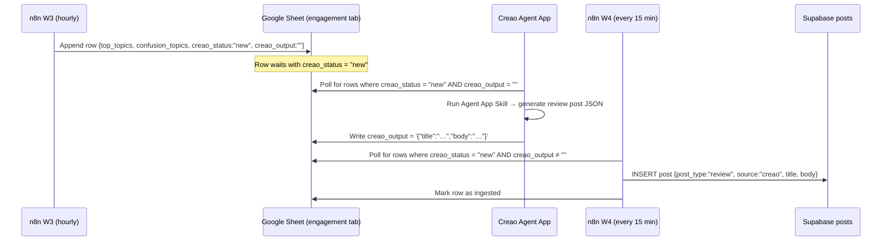

# Creao — AI-Generated Review Content for Scrollabus

Scrollabus uses [Creao](https://creao.ai) as an ambient content layer that runs alongside the n8n pipeline. Where n8n generates persona-voiced posts directly from student-uploaded materials, Creao runs a standing Agent App that reads aggregated engagement signals and produces spaced-repetition review posts independently — without being triggered by any individual upload.

---

## What Creao Does

Creao is an AI-native workspace built around reusable Agent Apps. Rather than re-prompting a model for each task, Creao lets you crystallise a successful AI session into a durable, versioned system that your team (or automation pipeline) can run repeatedly with consistent results.

For Scrollabus, Creao handles one specific job: **generating `review`-type posts from engagement data**. These are the posts that bubble up material students have previously seen, now presenting it in a fresh framing — a synthesised recap, a "you struggled with this, let's revisit it" card, or a spaced-repetition prompt. They are not generated by n8n's sub-workflows and they are not tied to any single material upload. They sit in the feed as ambient reinforcement, identified by `source = 'creao'` and `post_type = 'review'`.

---

## How the Integration Works

The bridge between Scrollabus and Creao is a Google Sheet acting as a shared message bus. Three components take part:

**n8n Workflow 3** (runs every hour) calls the `get_engagement_summary` Supabase RPC, formats the results, and appends a new row to the `engagement` tab of the Google Sheet:

| Column | Value |
|---|---|
| `timestamp` | ISO 8601 timestamp of the sync |
| `top_topics` | JSON array of topics with highest saves and likes |
| `confusion_topics` | JSON array of topics with high quiz failure rates |
| `total_saves` | Aggregate save count since last sync |
| `total_comments` | Aggregate comment count since last sync |
| `creao_status` | Set to `new` |
| `creao_output` | Empty string (Creao fills this in) |

**Creao Agent App** watches the sheet via the Google Sheets Connector. When it finds rows with `creao_status = new` and an empty `creao_output`, it runs the skill, writes the generated content back into `creao_output`, and leaves `creao_status` as `new` so n8n can detect it on the next poll.

**n8n Workflow 4** (runs every 15 minutes) reads rows where `creao_status = new` AND `creao_output` is non-empty, parses the output, inserts a `post_type = 'review'` post into Supabase, and marks the row as ingested so it is not processed twice.



---

## The Creao Agent App

The Agent App is built in Creao's workspace and published as a standing automation. Its Skill encodes the following logic:

1. **Read context**: parse `top_topics` and `confusion_topics` from the incoming sheet row.
2. **Select a frame**: choose one of four review frames based on the data — *synthesised recap*, *common-mistake spotlight*, *spaced-repetition prompt*, or *compare-and-contrast* — weighted by whether confusion topics are present.
3. **Generate the post**: produce a JSON object with two fields:
   ```json
   {
     "title": "Short punchy title (max 10 words)",
     "body": "The post content — 2–4 short paragraphs or a brief bulleted list"
   }
   ```
4. **Write back**: update `creao_output` in the sheet row with the JSON string.

The Skill prompt instructs the model to write in a neutral, encouraging academic voice — not tied to any single persona. The Lecture Bestie persona ID is applied by n8n Workflow 4 when inserting the post into Supabase, because review posts need a persona assigned and Lecture Bestie's plain-English style is the closest match to a neutral recap voice.

---

## Creao Connector Setup

The integration uses Creao's Google Sheets Connector (MCP-based). Configuration steps:

1. In your Creao workspace, go to **Connectors → Add Connector → Google Sheets**.
2. Authenticate with the Google account that owns the sheet.
3. Grant read/write access to the sheet identified by `GOOGLE_SHEET_ID`.
4. In the Agent App, set the target tab to `engagement`.

The Connector polls on a configurable interval (set to 5 minutes in the Scrollabus workspace). There is no webhook — Creao pulls from the sheet rather than being pushed to.

---

## Output Format

n8n Workflow 4 accepts either a raw string or a JSON object in `creao_output`:

```javascript
// Node: Build post from Creao output
let title = 'Review: ' + new Date(row.timestamp).toLocaleDateString();
let body = row.creao_output;

try {
  const parsed = JSON.parse(row.creao_output);
  title = parsed.title ?? title;
  body = parsed.body ?? body;
} catch (e) {
  // use raw text as body
}
```

The fallback means that if Creao's model returns plain prose instead of JSON (e.g. during an output format slip), Workflow 4 degrades gracefully — the post is inserted with a generic date-based title and the raw text as the body.

---

## Posts Produced

Creao posts appear in the Scrollabus feed alongside n8n-generated posts. They are distinguishable by:

- `source = 'creao'` in the `posts` table
- `post_type = 'review'`
- `persona_id` = Lecture Bestie (applied by Workflow 4, not Creao)
- No `material_id` — review posts are not tied to a specific upload

The feed algorithm treats them identically to n8n posts in terms of display. The `source` column is surfaced in the admin/debug view only.

---

## Configuring the Agent App Skill

The Skill used in the Scrollabus Creao workspace encodes the generation prompt as a versioned instruction set. The current version (v3) uses this core prompt fragment:

> You are an expert academic content writer producing spaced-repetition review posts for a TikTok-style study app. Your audience is university students who have recently studied these topics.
>
> Input:
> - top_topics: topics students engaged with most (saved, liked)
> - confusion_topics: topics where students failed quizzes or disengaged
>
> Your task: write a review post that revisits one or two of the most important or confusing topics. Choose the framing that best fits the data (recap, common-mistake spotlight, spaced prompt, or compare-contrast).
>
> Output: valid JSON with exactly two fields — "title" and "body". No markdown fences. No extra text.

Version control in Creao means the previous prompt versions (v1, v2) are still accessible and can be restored if the current output quality degrades.

---

## Relationship to n8n Workflow 3 (Engagement Sync)

Workflow 3 is what feeds Creao. It calls the `get_engagement_summary` Supabase RPC — an internal function that aggregates likes, saves, comments, and quiz failure data across all posts, grouping by topic tags. The formatted output is what Creao reads to understand the current state of learner engagement.

The sync runs every hour. Creao's 5-minute poll interval means new engagement data is picked up within 5 minutes of being written. The full round-trip latency (engagement event → Supabase → Workflow 3 → Sheet → Creao → Sheet → Workflow 4 → post visible in feed) is at most ~75 minutes in the worst case and typically under 30 minutes.

---

## Troubleshooting

**Creao output column stays empty**
- Check that the Creao Agent App is active (not paused) in the Creao workspace.
- Verify the Google Sheets Connector is authenticated and the `GOOGLE_SHEET_ID` variable points to the correct sheet.
- Check Creao's execution log for any output format errors.

**Workflow 4 inserts posts with a date-based title instead of a proper title**
- Creao returned plain text instead of JSON. Check the Agent App Skill output — the model may have added a markdown fence or preamble. Update the Skill prompt to reinforce JSON-only output.

**Duplicate `review` posts appearing in the feed**
- Workflow 4's "Mark row as ingested" step failed. Check the Google Sheets node in n8n for auth errors. The node needs write permission on the sheet.

**`creao_status` column missing from the sheet**
- Workflow 3 creates the column automatically on first run via the autoMapInputData setting. If the column is absent, run Workflow 3 manually once to populate it.
