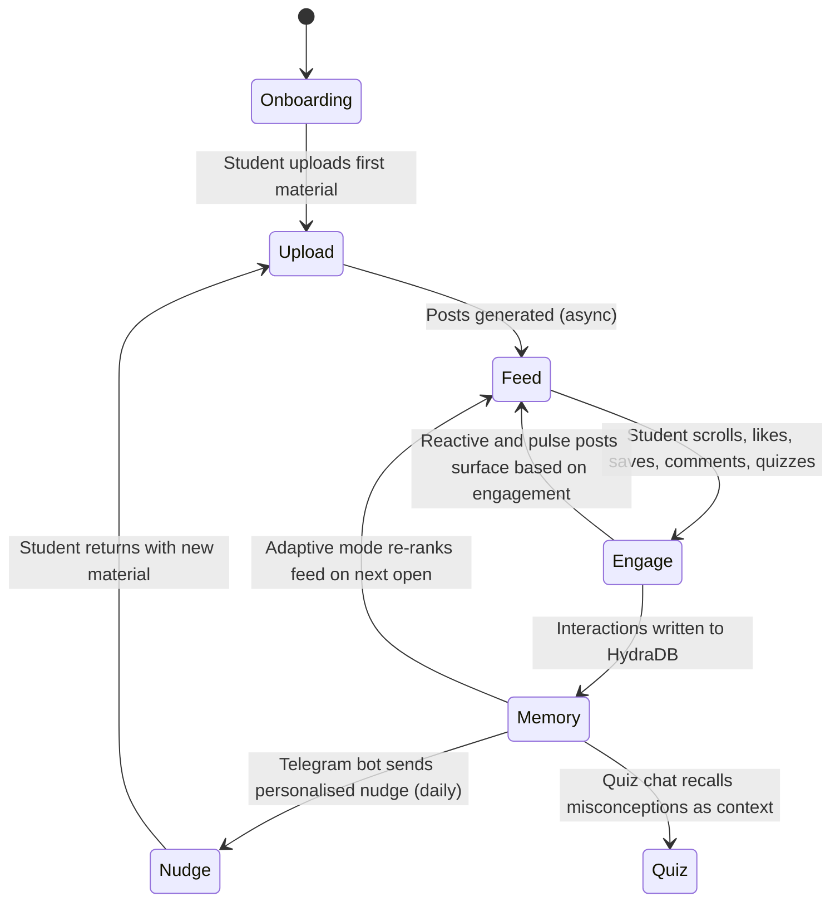
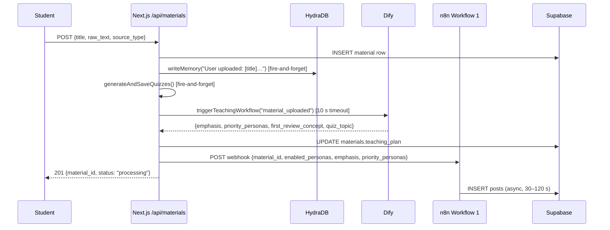
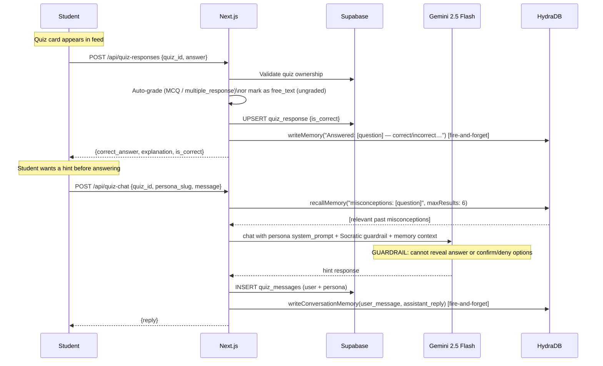
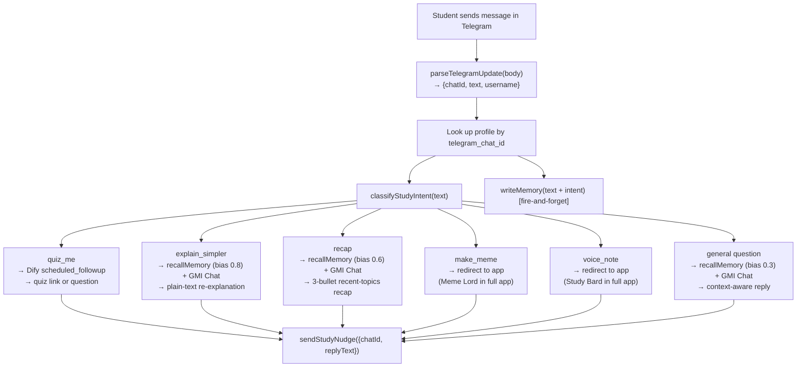

# How Scrollabus Enhances the Learner Experience

Scrollabus is not a static content delivery tool. Every interaction a student has — scrolling, liking, saving, answering a quiz, commenting, replying to a Telegram message — feeds back into how that student's experience is shaped next time. This document explains the mechanisms behind that improvement loop, from first login to long-term study companion.

---

## The Core Loop

A student's experience in Scrollabus runs through six stages that repeat and compound over time:



Each pass through the loop makes the experience more personalised: the feed becomes more relevant, quizzes become more targeted, nudges become more specific, and the AI chat responses become more contextually aware.

---

## Stage 1: Onboarding

Before a student sees a single post, Scrollabus gathers four signals that shape everything that follows.

**Interests** — A multi-select grid of academic subject tags. These are stored in `profiles.interests[]` and used by the Community tab's `get_similar_users` RPC to surface study partners, and by the Explore feed to surface relevant trending content.

**Active personas** — Students select which of the six built-in personas they want generating content for them. Stored in `profiles.enabled_personas[]`. On material upload, only enabled personas generate posts — so a student who dislikes meme-style content can turn off Meme Lord and never see those posts. Default: Lecture Bestie, Exam Gremlin, Problem Grinder.

**AV output preference** — A toggle for whether audio and image posts should be generated. Students who prefer to study in quiet environments can disable AV output and receive only text posts. Stored in `profiles.enable_av_output`. This flag is passed directly to n8n Workflow 1 and controls which sub-workflows are executed per upload.

**Telegram bot opt-in** — Students link their Telegram account by clicking a deep link (`https://t.me/{bot_username}?start={token}`) from the profile page. Clicking the link opens Telegram and sends `/start TOKEN` to the bot, which matches the token to the student's profile and sets `profiles.telegram_chat_id`, `profiles.telegram_username`, and `profiles.telegram_enabled = true`. A `telegram_link_token` is generated on demand by `GET /api/telegram/connect` and discarded once the account is linked. No nudges are sent until the student explicitly completes the linking flow.

---

## Stage 2: Material Upload and Content Generation

When a student uploads study material, three learning-enhancement systems activate in parallel:



**What each system adds:**

- **HydraDB memory write** records that the student studied this topic, enabling future recall for quiz hints, Telegram nudges, and feed re-ranking.
- **Quiz generation** (Gemini 2.5 Flash, `lib/quizzes.ts`) produces 3 persona-voiced quiz questions immediately. Each quiz is written in the style of the persona that generated it — Exam Gremlin writes trap-focused MCQs, Problem Grinder writes application-heavy free-text questions, Lecture Bestie writes approachable confidence-builders.
- **Dify teaching plan** analyses the material against the student's past learning history (from HydraDB) and returns: which personas should be prioritised, what concept to emphasise, what the first spaced-repetition concept should be, and what the best quiz topic is. This plan is passed to n8n so the generated posts are pedagogically informed — not just a generic breakdown of the material.

---

## Stage 3: The Feed as a Learning Surface

The home feed is the primary interface for consuming content. Several mechanisms make it more effective than a static reading list.

### Persona diversity by design

Up to six distinct teaching styles present the same material in different ways. A concept explained plainly by Lecture Bestie, framed as a trap by Exam Gremlin, worked through step-by-step by Problem Grinder, drawn as a comic by Doodle Prof, memed by Meme Lord, and sung by Study Bard. Students who miss the concept in one framing typically grasp it in another. This mirrors the cognitive science principle of elaborative interrogation — encountering the same information in multiple formats deepens encoding.

### Exponential decay interleaving

The feed does not show all posts from the newest material before older ones. It allocates slots across the student's last five uploads using exponential decay (decay constant `0.6`), then interleaves them round-robin. A student who uploads five PDFs over a semester sees content from all of them in a single scroll session — not just the most recent one. This provides natural spaced repetition without any explicit scheduling.

### Adaptive persona re-ranking

On any feed request with `?mode=adaptive`, the feed fetches the student's `get_persona_affinity` scores and reranks posts within each material bucket toward higher-affinity personas:

| Engagement signal | Affinity points |
|---|---|
| Like on a persona's post | +3 |
| Save on a persona's post | +3 |
| Human comment on a persona's post | +2 |
| Dwell ≥ 2 seconds on a persona's post | +1 |

A student who consistently saves Exam Gremlin posts and comments on them will gradually see more Exam Gremlin content in their feed — not because the algorithm guesses their preference, but because their actual behaviour signals it.

### Impression tracking

Every post the student views records an impression with `duration_ms`. This feeds into the `get_persona_affinity` RPC (dwell time) and into Workflow 3's engagement summary (written to the Google Sheet for Creao). Over time, dwell time data reveals which post types and personas hold the student's attention — and the adaptive feed acts on that.

### Quiz cards inline

Quizzes appear in the scroll at an interval of 4–6 posts (`QUIZ_INSERT_INTERVAL`). They are not a separate screen — they surface inside the same TikTok-style card flow, making assessment feel continuous rather than interruptive. Students can skip a quiz card by scrolling past it, or tap to attempt it inline.

---

## Stage 4: Quizzes and the Feedback Guardrail

Inline quizzes are the primary diagnostic surface in Scrollabus. They serve three functions: testing recall, surfacing misconceptions for memory, and providing Socratic coaching before the answer is revealed.



**What makes the quiz experience adaptive:**

- **Persona voice on questions**: a quiz written by Exam Gremlin presents distractors that represent real traps. A quiz written by Problem Grinder requires showing working rather than selecting an option. Students get different kinds of practice depending on which personas are active.
- **Socratic guardrail**: before the student answers, the chat assistant cannot reveal the correct answer or confirm/deny any option. It can only give hints and ask guiding questions. After the student answers, full explanation and deeper teaching become available.
- **Memory on every answer**: the question, the student's answer, whether it was correct, and the explanation are all written to HydraDB. This means future quiz chats, Telegram nudges, and Dify teaching plans have a record of exactly what the student struggled with.

---

## Stage 5: Comments and Direct Messages

Both comments and DMs extend the teaching moment beyond passive consumption.

### Comment replies

When a student comments on a post, n8n Workflow 2 calls Featherless AI (DeepSeek-V3.2) to generate an in-character reply from the persona. The reply system prompt uses the same persona voice as the original post — Exam Gremlin will reply with a mischievous follow-up trap, Lecture Bestie will validate and elaborate. This turns the comment section into a lightweight back-and-forth tutoring channel within the feed.

The `learner_context` field passed to n8n by `/api/comments` is a short string derived from the student's profile and recent activity. It allows the persona's reply to acknowledge what the student is working on without breaking character.

### Direct messages

Students can open a bottom sheet for any persona and send a freeform message — `/api/personas/[slug]/dm` handles these via Gemini 2.0 Flash with a stateful multi-turn chat session. The persona's full `system_prompt` is used as the system instruction, so the DM conversation is tonally consistent with the post content. A student who wants to ask Exam Gremlin "will this type of question definitely appear?" gets a response in Exam Gremlin's voice, not a generic assistant response.

---

## Stage 6: Learner Memory (HydraDB)

HydraDB is the persistent memory layer that makes Scrollabus aware of each student's learning history across sessions. It stores unstructured text memories, indexed by user, with semantic search and recency-biased recall.

### What gets written to memory

| Trigger | Memory written |
|---|---|
| Material upload | `"User uploaded: [title] ([source_type]). Topic preview: [first 200 chars]"` |
| Quiz answer | `"Answered: [question] — [correct/incorrect]. Their answer: [answer]. Correct: [correct_answer]. Explanation: [explanation]"` |
| Quiz chat exchange | Conversation pair `{user_message, assistant_message}` via `writeConversationMemory` |
| Telegram inbound reply | `"Student replied via Telegram: [text] (intent: [intent])"` |

All writes use `infer: true`, which instructs HydraDB to automatically extract preferences, patterns, and insights from the text — going beyond verbatim storage to build a structured learner profile over time.

### Where memory is recalled

| Recall point | Query | Max results | Recency bias |
|---|---|---|---|
| Quiz chat (before answer) | `"misconceptions and struggles: [question]"` | 6 | 0.2 |
| Telegram `explain_simpler` | `"most recent concept studied, last topic reviewed"` | 5 | 0.8 |
| Telegram `recap` | `"recent study topics and concepts"` | 8 | 0.6 |
| Telegram `general_question` | The student's message text | 6 | 0.3 |
| Telegram cron nudge | `"weak concepts, things not reviewed recently, upcoming exams, repeated mistakes"` | 10 | 0.4 |
| Feed load (adaptive) | `"weak concepts, stale topics"` → fires Dify `feed_opened` event | 5 | 0.1 |

Recency bias controls the trade-off between relevance and freshness. The quiz chat uses a low bias (0.2) because the most relevant past misconception may be weeks old. The `explain_simpler` intent uses a high bias (0.8) because the student is asking about something they just studied.

---

## Stage 7: Dify Teaching Plan

Dify is a visual workflow orchestration tool that sits between Scrollabus and GMI Cloud (DeepSeek/Llama). It receives structured events and returns pedagogical decisions.

The teaching workflow has four event branches:

| Event | When triggered | Output |
|---|---|---|
| `material_uploaded` | Every material upload | `{emphasis, priority_personas, first_review_concept, quiz_topic}` |
| `feed_opened` | On fresh feed load, if weak concepts found in memory | (informs future nudge content) |
| `scheduled_followup` | Telegram cron (daily) or `quiz_me` inbound intent | `{nudge_message}` |
| `comment_posted` | After a comment is submitted | (available; not wired in current default config) |

The `material_uploaded` output is the most consequential: `priority_personas` tells n8n which personas to produce more posts for this particular material, and `emphasis` is a short string injected into each sub-workflow's prompt to focus generation on the most pedagogically important aspect of the content.

For example, if a student uploads lecture notes on the water cycle and HydraDB shows they previously struggled with condensation, Dify can return `{ emphasis: "focus on condensation and why it happens at specific temperatures", priority_personas: ["exam-gremlin", "problem-grinder"] }`. The posts generated from that upload will lean on the two personas best suited to reinforcement and practice, and their prompts will explicitly direct the LLM toward the student's known weakness.

---

## Stage 8: Telegram Bot — The Ambient Companion

The Scrollabus Telegram bot operates outside the app. It is the mechanism by which Scrollabus stays present in a student's day without requiring them to open the app. The bot uses the Telegram Bot API directly via fetch (`lib/telegram.ts`) — no third-party SDK.

### Account linking

Students link their Telegram account from their Scrollabus profile page:

1. `GET /api/telegram/connect` generates a unique `telegram_link_token` and returns a deep link: `https://t.me/{bot_username}?start={token}`.
2. The student clicks the link, which opens Telegram and sends `/start TOKEN` to the bot.
3. `POST /api/telegram/webhook` receives the `/start TOKEN` update, looks up the profile by `telegram_link_token`, writes `telegram_chat_id`, `telegram_username`, and `telegram_enabled = true` to the profile row, and clears the token.
4. The bot replies with a welcome message confirming the connection and listing available reply commands.

Students can pause nudges or unlink entirely at any time via `POST /api/telegram/connect` with `{ enabled: false }` or `{ unlink: true }`.

### Outbound nudges (daily cron)

Every day at a configured time (default: `0 18 * * *` — 6 pm UTC), `GET /api/telegram/cron` fires for every student with `telegram_enabled = true` and a non-null `telegram_chat_id`. For each student:

1. HydraDB is queried for weak concepts, stale topics, and repeated mistakes (`maxResults: 10`, `recencyBias: 0.4`).
2. If no memories are found, the nudge is skipped — Scrollabus does not send generic spam to new users.
3. If memories are found, Dify generates a personalised nudge message via the `scheduled_followup` event (GMI Cloud, under 200 characters, specific to the student's known weak spots).
4. The message is sent to the student's `telegram_chat_id` via `sendStudyNudge()`.

### Inbound replies

When a student replies, Telegram pushes the update to `POST /api/telegram/webhook`. The text is parsed from the `TelegramUpdate` object and the intent is classified by `classifyStudyIntent()`:



Every inbound message is written to HydraDB (including the classified intent). A student who repeatedly sends "explain simpler" signals that the generated content is too advanced — the Dify workflow uses this pattern to adjust future `emphasis` signals for that student's uploads.

### Setup (one time per deployment)

After deploying, register the webhook URL with Telegram by calling:

```bash
curl -X POST https://your-app.vercel.app/api/telegram/setup-webhook \
  -H "Authorization: Bearer $CRON_SECRET" \
  -H "Content-Type: application/json"
```

This calls `setWebhook()` in `lib/telegram.ts`, which posts the app's `/api/telegram/webhook` URL to `https://api.telegram.org/bot{TOKEN}/setWebhook`. Telegram then pushes all bot updates to that endpoint. No polling is required.

---

## Stage 9: Content that Learns from the Cohort

Two scheduled n8n workflows generate content not from individual uploads but from aggregate engagement patterns across all students.

**Workflow 7 (Reactive Content)** reads quiz failure hotspots — concepts where a statistically significant portion of students answered incorrectly — and generates targeted remedial posts (`source = 'reactive'`). These posts appear in the feeds of students who studied that concept, authored by the persona best suited to remediation. A widespread failure on a thermodynamics concept might trigger Exam Gremlin to post a trap-busting explanation.

**Workflow 8 (Persona Pulse)** reads broad engagement trends — what is being studied most, where dwell time is highest, what concepts are generating the most comments — and writes community update posts (`post_type = 'pulse'`) in each persona's voice. These give the feed a sense of continuity and collective energy: Lecture Bestie might acknowledge "a lot of you have been grinding thermodynamics this week — here's a perspective shift."

Together, these two workflows close the feedback loop from individual engagement → aggregate signal → targeted content improvement for all students.

---

## The Compound Effect Over Time

The mechanisms above are individually useful but compound dramatically over time:

```
Week 1   Student uploads first PDF.
         3 quizzes generated. Memory: first topic written.
         Feed: 20–30 posts from 3 default personas.

Week 2   Student uploads two more PDFs.
         Dify detects a pattern in quiz failures from Week 1.
         n8n emphasises those concepts in new posts.
         Adaptive feed starts re-ranking toward personas the student engages with.

Week 3   Telegram cron starts sending nudges.
         Memory has enough data to generate specific, accurate nudge messages.
         Student replies "explain simpler" — the reply references their actual recent study context.

Month 2  Reactive content begins appearing for concepts where the student
         (and cohort) have consistently struggled.
         Quiz chat conversations cite past misconceptions in hint responses.
         The Dify teaching plan has weeks of HydraDB data to draw from.

Month 3  The student's feed looks different from any other student's.
         Persona affinity scores have stabilised around 2–3 personas.
         Quiz chat responses are visibly more targeted.
         Telegram nudges reference specific concepts by name.
```

The experience does not personalise all at once — it improves incrementally with each interaction. A student who uploads one PDF and never returns sees exactly one pass of the loop. A student who uploads regularly, answers quizzes, comments, and links their Telegram account experiences a system that grows genuinely more useful with every session.
