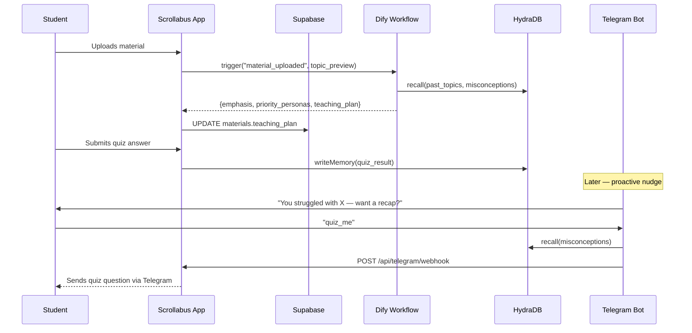

# Miro & Mobbin — Planning and Frontend Design Reference

Scrollabus was planned and designed before a single line of code was written. Miro was the workspace where the product was thought through — from initial concept maps to detailed user flows and the n8n architecture. Mobbin was the reference library used to research real-world patterns in mobile feed apps, ensuring the frontend design decisions were grounded in how students already expect to interact with content on their phones.

---

## Miro

[Miro](https://miro.com) is a collaborative online whiteboard. For Scrollabus it served as the single source of truth for planning across the full project lifecycle — ideation, architecture, flows, and persona design.

### What We Used Miro For

#### 1. Initial Concept Map

The first Miro board was a loose brainstorm connecting three anchor ideas:
- Students spend more time on TikTok than reading their notes.
- LLMs can adopt consistent personas.
- Short-form content is inherently more digestible than full lecture transcripts.

The concept map expanded outward from those anchors to surface the core interaction loop (upload → feed → quiz → memory → nudge) and identify where AI needed to intervene at each step.

#### 2. User Flow Diagrams

Before the Next.js routing structure was decided, the full user journey was mapped in Miro:

```
[Sign up / Login]
      │
      ▼
[Onboarding: interests → enable personas → AV preferences → Telegram bot opt-in]
      │
      ▼
[Home Feed — empty state]
      │
      ├─ [Upload material → PDF / paste text]
      │         │
      │         ▼
      │   [Feed populates with persona posts]
      │         │
      │         ├─ [Swipe / scroll]
      │         ├─ [Like / Save / Comment]
      │         ├─ [Quiz card inline]
      │         │       └─ [Quiz chat for hints]
      │         └─ [DM persona sheet]
      │
      ├─ [Explore tab — trending + external content]
      ├─ [Saved tab — collections]
      ├─ [Community tab — similar users]
      └─ [Profile — manage uploads, personas, Telegram]
```

This flow diagram drove the Next.js App Router structure directly: each top-level tab (`/feed`, `/explore`, `/saved`, `/community`, `/profile`) maps to a route group node on the Miro board.

#### 3. Persona Matrix

A Miro table mapped the six built-in personas against four dimensions — **tone**, **post type**, **media output**, and **quiz strategy** — to ensure no two personas overlapped in a way that would make the feed feel repetitive:

| Persona | Tone | Primary post type | Media | Quiz flavour |
|---|---|---|---|---|
| Lecture Bestie | Warm, casual | concept | text / audio | Friendly MCQ |
| Exam Gremlin | Mischievous | trap | text | Trap-heavy MCQ |
| Problem Grinder | Methodical | example | text | Application / free text |
| Doodle Prof | Visual, quirky | concept | image (comic) | Visual / spatial |
| Meme Lord | Chaotic-good | concept | image (meme) | Pop culture MCQ |
| Study Bard | Musical | recap | audio (song) | Lyric-fill MCQ |

This matrix was referenced during the system prompt drafting and the quiz strategy design in `lib/quizzes.ts`.

#### 4. n8n Architecture Whiteboard

The n8n workflow architecture was fully mapped in Miro before any workflow JSON was written. The board showed:
- Which workflows were webhook-triggered vs. scheduled
- The parent-child relationship between Workflow 1 (orchestrator) and sub-workflows 1a–1e
- The data flow from material upload through to Supabase post insertion
- The Google Sheet bridge between Workflow 3 (engagement sync) and the Creao Agent App, then back to Workflow 4 (Creao ingest)
- Where Featherless AI (text generation) vs. Gemini (image, TTS, PDF) vs. ElevenLabs (TTS) each sat in the pipeline

The board was the reference document during the n8n build phase, with nodes on the whiteboard annotated with the actual n8n node types used.

#### 5. Memory and Companion Layer Design

The HydraDB + Dify + Telegram interaction was mapped as a sequence diagram in Miro:



This sequence diagram was drawn in Miro and then used as the implementation spec for `lib/hydra.ts`, `lib/dify.ts`, `lib/telegram.ts`, and the `/api/telegram/webhook` route.

#### 6. Database Schema Iteration

Early schema decisions were made on a Miro board using sticky-note entity boxes before the SQL was written. The relationships between `materials`, `posts`, `quizzes`, `quiz_responses`, `quiz_messages`, and the learner memory tables were sketched out, debated, and refined before `supabase/schema.sql` was committed.

---

## Mobbin

[Mobbin](https://mobbin.com) is a library of 600,000+ real-world UI screenshots and flows from 1,150+ apps. It was used throughout the frontend design phase to research how successful consumer apps handle patterns that Scrollabus depends on.

### What We Used Mobbin For

#### 1. Vertical Feed / For-You Page Patterns

The core Scrollabus interaction is a vertical-scroll feed of content cards — directly analogous to TikTok's FYP. Mobbin was used to study how TikTok, Instagram Reels, YouTube Shorts, and BeReal structure their feed cards:

- **Card height**: full-viewport-height cards for strong scroll anchoring, with a peek of the next card to signal scrollability
- **Action bar placement**: persistent right-side action column (like, save, comment, share) — a pattern consistent across TikTok, Reels, and Shorts; implemented in `components/ActionBar.tsx`
- **Persona badge**: top-left overlay with avatar + name, referencing how creator identity is shown on TikTok and Cameo
- **Post type tag**: small pill in the top-right corner, referencing how YouTube labels shorts/live/premiere and how Reddit labels post types
- **Progress indicator**: thin bar at the top of image/slideshow cards, referencing Instagram Stories' progress bar

#### 2. Bottom Sheet Patterns

Scrollabus uses Vaul bottom sheets extensively — for comments, saves, persona profiles, quiz chat, and category assignment. Mobbin was used to research bottom sheet behaviour across a range of apps:

- **Comment sheets**: studied Threads, TikTok, and Instagram for comment nesting depth, reply affordances, and AI-generated reply visual treatment
- **Save / collection sheets**: studied Pinterest boards, TikTok favourites, and Spotify playlist assignment for the "add to collection" interaction; informed the `SaveCategorySheet` component
- **Profile bottom sheets**: studied Twitter/X user cards and LinkedIn "Open to" panels for compact persona profile sheets; informed `PersonaProfileSheet`
- **Confirmation dialogs**: studied Airbnb and Duolingo for destructive-action confirmation patterns; informed `ConfirmSheet`

#### 3. Onboarding Flows

The four-step onboarding (interests → persona selection → AV preferences → Telegram opt-in) was designed after studying Mobbin flows for apps with heavy personalisation onboarding:

- **Duolingo**: single-question-per-screen, large tap targets, strong visual reward for progression
- **Spotify**: interest/genre selection with multi-select pill grid — directly referenced in `components/InterestsPills.tsx`
- **Calm / Headspace**: progressive disclosure — don't ask for personal data before showing value; Scrollabus mirrors this by asking for interests before offering the Telegram bot opt-in

#### 4. Quiz Card Design

The inline quiz card was designed after studying Duolingo's lesson cards, Quizlet's flashcard flip, and Kahoot's in-game question display:

- **Question above options**: consistent across all three references; used in `QuizCard`
- **Option selection feedback**: immediate colour change on selection (green/red), matching Duolingo's instant feedback model
- **Free-text response**: studied Wordle's keyboard interaction and Duolingo's write-mode for how to present an open-text answer within a compact card
- **"Ask [persona]" chat affordance**: studied how Duolingo's explanation CTA appears post-answer; the "chat with persona" button in `QuizHelpSheet` mirrors this placement

#### 5. Empty States

The empty feed state (before a student uploads their first material) is a critical moment. Mobbin's collection of empty state patterns was used to study:

- **Mailchimp**: illustrated empty states that explain the value proposition rather than just saying "nothing here yet"
- **Linear**: minimal, action-oriented empty states with a single primary CTA
- **Notion**: empty states that show a preview of what will appear, setting expectations

The Scrollabus `EmptyFeedLanding` component takes a hybrid approach — a brief explanation of what the feed will become, a single upload CTA, and a row of persona avatar chips to make the personas feel tangible before any content exists.

#### 6. Navigation Patterns

The bottom navigation bar (`BottomNav`) was studied through Mobbin flows for Instagram, TikTok, Reddit, and Pinterest:

- **Five-tab limit**: consistent across all references; Scrollabus has Feed, Explore, Upload, Saved, Profile
- **Upload as centre tab**: TikTok's "+" and Instagram's "+" both centre the primary creation action; Scrollabus follows this with the Upload tab as the centre item
- **Active state treatment**: studied how Reddit uses a filled icon for active, outline for inactive; Scrollabus uses filled vs. outline icons with accent colour tint

---

## How the Two Tools Related

Miro and Mobbin were used in sequence, not in parallel. Miro came first — it defined *what* the product needed to do and *how* data and user interactions would flow. Mobbin came second — it defined *how* those interactions should look and feel based on patterns that users of consumer social apps already understand intuitively.

The handoff between the two was a Miro board page called "Pattern Library Findings" that collected Mobbin screenshots (saved as PNGs) alongside annotations about which Scrollabus component each pattern informed.
