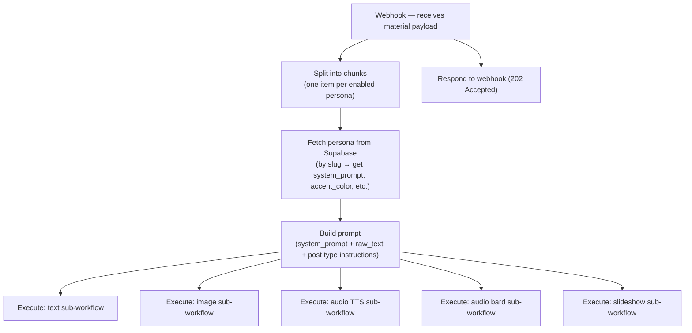
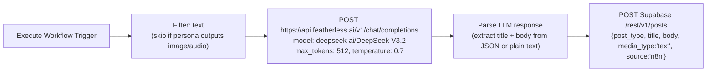
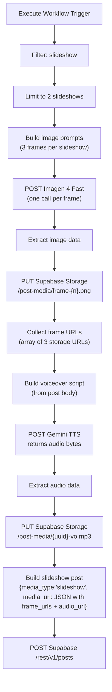
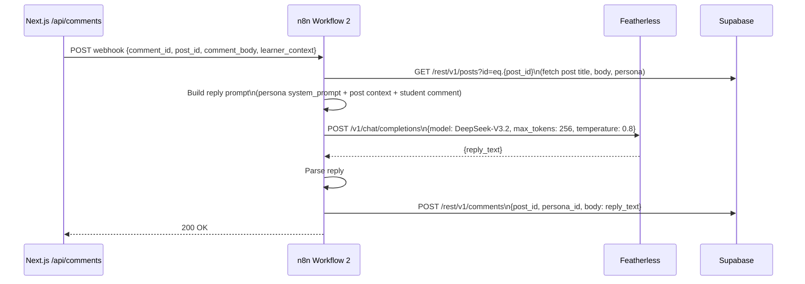
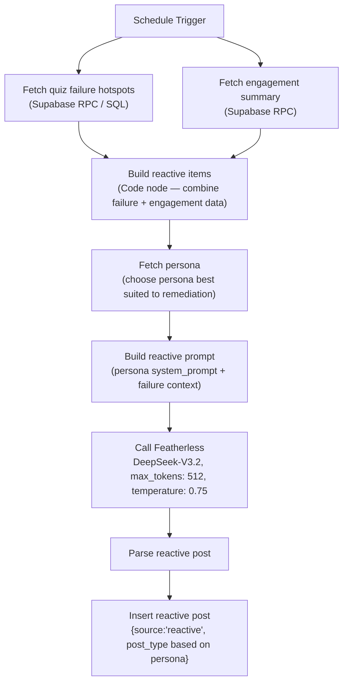
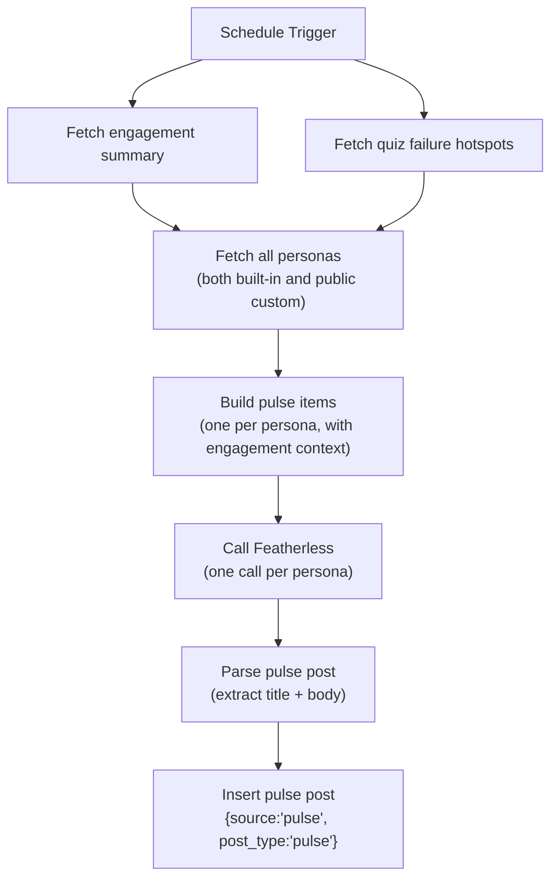
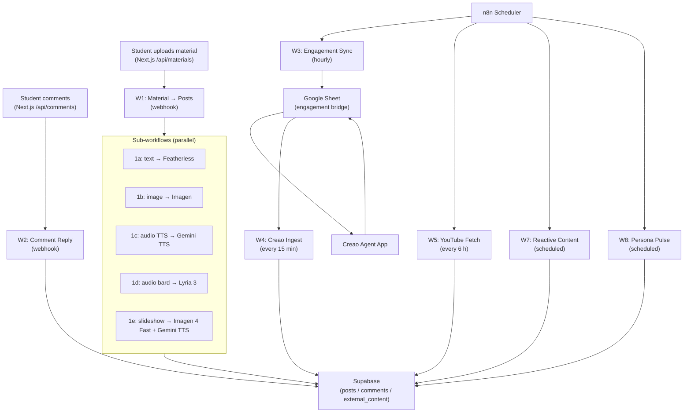

# n8n — Workflow Automation in Scrollabus

Scrollabus uses [n8n](https://n8n.io) as its backend automation engine. All AI content generation, external data ingestion, comment reply handling, and engagement sync happen inside n8n workflows — not inside Next.js. This keeps the Next.js app focused on serving the UI and lightweight API operations, while n8n handles everything long-running, scheduled, or multi-step.

The n8n instance is self-hosted. All workflow JSON files live in the `n8n/` directory and can be imported directly.

---

## Why n8n

n8n was chosen over alternatives (Zapier, Make, custom workers) for three reasons:

1. **Self-hosted with full control**: API keys and model calls stay on infrastructure you own. No third-party SaaS stores Scrollabus content or student data.
2. **HTTP Request node flexibility**: Featherless AI and Supabase are called via plain HTTP, not a pre-built integration — n8n's HTTP node handles both with full header and body control.
3. **Sub-workflow execution**: Workflow 1 acts as an orchestrator that fans out to five parallel sub-workflows. n8n's Execute Workflow node handles this natively with item-level data passing.

---

## Workflow Overview

| File | Name | Trigger | Purpose |
|---|---|---|---|
| `workflow-1-material-to-posts.json` | Material → Posts | Webhook (POST) | Orchestrator: receives material upload payload, splits by persona, fans out to sub-workflows |
| `workflow-1a-sub-text.json` | Sub: Text | Execute Workflow | Generates text posts via Featherless AI |
| `workflow-1b-sub-image.json` | Sub: Image | Execute Workflow | Generates image posts via Featherless AI + Gemini Imagen (Nano Banana 2) |
| `workflow-1c-sub-audio-tts.json` | Sub: Audio TTS | Execute Workflow | Generates TTS audio posts via Gemini TTS |
| `workflow-1d-sub-audio-bard.json` | Sub: Audio Bard | Execute Workflow | Generates Study Bard song audio via Lyria 3 |
| `workflow-1e-sub-video.json` | Sub: Video | Execute Workflow | Generates slideshow posts: Imagen 4 Fast frames + Gemini TTS voiceover |
| `workflow-2-comment-reply.json` | Comment → AI Reply | Webhook (POST) | Generates in-persona AI comment replies via Featherless AI |
| `workflow-3-engagement-sync.json` | Engagement Sync | Schedule (hourly) | Writes engagement summary to Google Sheet for Creao |
| `workflow-4-creao-ingest.json` | Creao Ingest | Schedule (every 15 min) | Reads Creao-generated content from Google Sheet, inserts review posts |
| `workflow-5-youtube-fetch.json` | YouTube Fetch | Schedule (every 6 h) | Fetches YouTube video metadata, inserts into `external_content` |
| `workflow-6-tiktok-fetch.json` | TikTok Fetch | Schedule | Fetches TikTok oEmbed data, inserts into `external_content` |
| `workflow-7-reactive-content.json` | Reactive Content | Schedule | Generates remedial posts from quiz failure data via Featherless AI |
| `workflow-8-persona-pulse.json` | Persona Pulse | Schedule | Generates community update posts in each persona's voice via Featherless AI |

---

## Setup

### Prerequisites

- n8n instance (self-hosted via Docker or npm, or n8n Cloud)
- Featherless AI API key
- Supabase project URL and service-role key
- Google account with Sheets API access (for Workflows 3, 4, 5)
- YouTube Data API v3 key (for Workflow 5)
- Kling API key (for Workflow 1e video frames — optional)

### Import Workflows

1. In your n8n instance, go to **Workflows → Import from File**.
2. Import each JSON file from `n8n/` individually, in this order:
   - Sub-workflows first: `1a`, `1b`, `1c`, `1d`, `1e`
   - Then the orchestrator: `workflow-1-material-to-posts.json`
   - Then remaining workflows: `2` through `8`
3. After importing Workflow 1, open it and update the `workflowId` parameter in each Execute Workflow node to match the actual n8n IDs of the imported sub-workflows. The IDs are shown in the URL when you open each sub-workflow.

### Set n8n Variables

Go to **Settings → Variables** and add:

| Variable | Value |
|---|---|
| `FEATHERLESS_API_KEY` | Your Featherless API key |
| `SUPABASE_URL` | Your Supabase project URL (same as `NEXT_PUBLIC_SUPABASE_URL`) |
| `SUPABASE_SERVICE_KEY` | Your Supabase service-role key |
| `GOOGLE_SHEET_ID` | The Google Sheet ID for the Creao bridge |
| `YOUTUBE_API_KEY` | YouTube Data API v3 key |
| `KLING_API_KEY` | Kling API key (used in Workflow 1e) |

Variables are accessed inside workflows as `$vars.VARIABLE_NAME`.

### Set Webhook URLs in Next.js

After activating Workflow 1 and Workflow 2, copy their webhook URLs from n8n and add them to `.env.local`:

```bash
N8N_WEBHOOK_MATERIAL_TO_POST=https://your-n8n.example.com/webhook/scrollabus-material-to-posts
N8N_WEBHOOK_COMMENT_REPLY=https://your-n8n.example.com/webhook/scrollabus-comment-reply
```

### Activate All Workflows

Toggle every workflow to **Active** in the n8n workflow list. Scheduled workflows will not run until activated. Webhook workflows will not accept requests until activated.

---

## Workflow 1 — Material to Posts (Orchestrator)

This workflow is the most complex. It receives a POST from Next.js `/api/materials` after a student uploads study material, then fans out to five sub-workflows in parallel — one per media type.

### Trigger payload

```json
{
  "material_id": "uuid",
  "raw_text": "The full extracted text of the material...",
  "title": "Introduction to Thermodynamics",
  "enabled_personas": ["lecture-bestie", "exam-gremlin", "problem-grinder"],
  "enable_av_output": true,
  "priority_personas": ["exam-gremlin"],
  "emphasis": "Focus on entropy and the second law"
}
```

`priority_personas` and `emphasis` come from the Dify teaching plan — they are optional. When present, Workflow 1 biases the prompt towards those personas and injects the emphasis string into each sub-workflow's system prompt.

### What the orchestrator does



The webhook responds immediately with `202 Accepted` before the sub-workflows finish — the content pipeline runs asynchronously.

### Sub-workflow data contract

Each Execute Workflow node passes a single item with these fields to the sub-workflow:

```json
{
  "material_id": "uuid",
  "persona_id": "uuid",
  "persona_slug": "exam-gremlin",
  "system_prompt": "You are Exam Gremlin...",
  "user_prompt": "Material: Introduction to Thermodynamics\n\nEmphasis: Focus on entropy...\n\nGenerate...",
  "enable_av_output": true
}
```

---

## Sub-Workflow 1a — Text Posts

Generates text-only posts for personas that produce text output (Lecture Bestie, Exam Gremlin, Problem Grinder).



---

## Sub-Workflow 1b — Image Posts

Generates image posts for Doodle Prof and Meme Lord. Featherless produces a JSON description of the image; Gemini Imagen (Nano Banana 2) renders it.

```mermaid
flowchart LR
    Trigger["Execute Workflow Trigger"]
    Filter["Filter: image\n(Doodle Prof, Meme Lord only)"]
    BuildPrompt["Build image prompt\n(parse Featherless JSON → Imagen prompt string)"]
    Imagen["POST Gemini Imagen\n(Nano Banana 2)\nreturns base64 PNG"]
    ExtractImg["Extract image data"]
    Upload["PUT Supabase Storage\n/post-media/{uuid}.png"]
    BuildPost["Build post object\n{media_type:'image', media_url: storage URL}"]
    Insert["POST Supabase /rest/v1/posts"]

    Trigger --> Filter --> BuildPrompt --> Imagen --> ExtractImg --> Upload --> BuildPost --> Insert
```



Note: Featherless is not called directly in sub-workflow 1b. The LLM call (to get the image description JSON) happens in Workflow 1's Build Prompt node before the sub-workflow is invoked. Sub-workflow 1b receives the structured JSON description already and only calls Imagen.

---

## Sub-Workflow 1c — Audio TTS

Generates narrated audio posts for Lecture Bestie.

```mermaid
flowchart LR
    Trigger["Execute Workflow Trigger"]
    Filter["Filter: audio TTS\n(Lecture Bestie only)"]
    BuildPrompt["Build audio prompt\n(extract narration text from post body)"]
    Split["Split in Batches\n(handles multi-segment text)"]
    ElevenLabs["Call ElevenLabs TTS\n(Code node — HTTP call with ELEVENLABS_API_KEY)"]
    Upload["PUT Supabase Storage\n/post-media/{uuid}.mp3"]
    BuildPost["Build audio post\n{media_type:'audio', media_url}"]
    Insert["POST Supabase /rest/v1/posts"]

    Trigger --> Filter --> BuildPrompt --> Split --> ElevenLabs --> Upload --> BuildPost --> Insert
```



ElevenLabs TTS is called from a Code node rather than an HTTP Request node because the response is binary (audio bytes) and requires custom handling before upload.

---

## Sub-Workflow 1d — Audio Bard (Study Bard Songs)

Generates song audio for Study Bard persona using Lyria 3.

```mermaid
flowchart LR
    Trigger["Execute Workflow Trigger"]
    Filter["Filter: audio bard\n(Study Bard only)"]
    BuildLyria["Build Lyria prompt\n(extract song lyrics from Featherless JSON)"]
    Lyria["POST Lyria 3\nreturns audio data"]
    ExtractAudio["Extract audio data"]
    Upload["PUT Supabase Storage\n/post-media/{uuid}.mp3"]
    BuildPost["Build audio post\n{media_type:'audio', media_url}"]
    Insert["POST Supabase /rest/v1/posts"]

    Trigger --> Filter --> BuildLyria --> Lyria --> ExtractAudio --> Upload --> BuildPost --> Insert
```



---

## Sub-Workflow 1e — Slideshow Posts

Generates slideshow posts with multiple image frames and a voiceover audio track. Limited to 2 slideshows per material to avoid generation costs.



---

## Workflow 2 — Comment Reply

When a student comments on a post, Next.js fires a POST to this workflow's webhook. The workflow fetches the post and persona context from Supabase, calls Featherless AI to generate an in-character reply, and inserts it as a new comment authored by the persona.



The webhook responds synchronously — the Next.js API route awaits the response but discards any error (the fire-and-forget behaviour is in `lib/n8n.ts`, which does not surface webhook errors to the user).

---

## Workflow 3 — Engagement Sync

Runs every hour. Calls `get_engagement_summary` Supabase RPC, formats the result, and appends a row to the Google Sheet for Creao to process.

**Output row schema:**

```
timestamp | top_topics (JSON) | confusion_topics (JSON) | total_saves | total_comments | creao_status | creao_output
```

This workflow feeds the Creao bridge. See `docs/CREAO.md` for the full round-trip description.

---

## Workflow 4 — Creao Ingest

Runs every 15 minutes. Reads rows from the Google Sheet where `creao_status = new` and `creao_output` is non-empty, inserts them as `post_type = 'review'` posts in Supabase, and marks rows as ingested.

---

## Workflow 5 — YouTube Fetch

Runs every 6 hours. Fetches video metadata from a curated list of educational YouTube channels and runs a set of topic-based searches. Merges channel videos and topic search results, then upserts into the `external_content` table.

The YouTube API key is set as `YOUTUBE_API_KEY` in n8n variables. The same key is also needed in `.env.local` for the Next.js `/api/explore/search` live search route.

---

## Workflow 7 — Reactive Content

Runs on a schedule. Reads quiz failure hotspots and low-engagement post data from Supabase, identifies where students are collectively struggling, and generates targeted remedial posts (`source = 'reactive'`) via Featherless AI.



---

## Workflow 8 — Persona Pulse

Runs on a schedule. Generates `pulse` posts — community-oriented announcements written in each persona's voice, based on aggregate engagement trends. These give the feed a sense that the personas are "alive" and aware of what students are studying collectively.



---

## Data Flow Summary



---

## n8n Variables Reference

| Variable | Used by | Notes |
|---|---|---|
| `FEATHERLESS_API_KEY` | W1a, W2, W7, W8 | Bearer token in Authorization header |
| `SUPABASE_URL` | All HTTP Request nodes that call Supabase | Same value as `NEXT_PUBLIC_SUPABASE_URL` |
| `SUPABASE_SERVICE_KEY` | All HTTP Request nodes that call Supabase | Used as both `apikey` header and `Authorization: Bearer` |
| `GOOGLE_SHEET_ID` | W3, W4 | Google Sheets document ID (from URL) |
| `YOUTUBE_API_KEY` | W5 | YouTube Data API v3 key |
| `KLING_API_KEY` | W1e | Kling video generation API key |

---

## Troubleshooting

**Workflow 1 triggers but no posts appear**
- Open n8n → Executions → find the Workflow 1 run → inspect the Execute Workflow nodes.
- The most common cause is incorrect `workflowId` values in the orchestrator — they must match the actual IDs of the imported sub-workflows.
- Check that `FEATHERLESS_API_KEY` is set as an n8n variable (not in `.env.local`).

**Sub-workflow 1b / 1c / 1d produce no posts**
- These sub-workflows call Gemini (Imagen, TTS) or Lyria. Verify the Gemini API key is accessible from within n8n's Code nodes (injected via environment variable or n8n credential).
- Check Supabase Storage bucket permissions — `post-media` must allow service-role inserts.

**Workflow 2 runs but no AI reply appears**
- Verify `FEATHERLESS_API_KEY` and `SUPABASE_SERVICE_KEY` are set.
- Check that the insert into `/rest/v1/comments` uses `persona_id` (not `user_id`) — persona comments must set `persona_id` and leave `user_id` null, or RLS will reject them.

**Workflow 3 appends rows but Creao doesn't process them**
- See `docs/CREAO.md` — Creao uses a Google Sheets Connector, not a push webhook.
- Check that the Creao Agent App is active and the Connector is authenticated.

**Workflow 5 fails with 403 on YouTube API**
- Quota exceeded: YouTube Data API v3 has a 10,000 unit/day quota. Each search call costs 100 units. At 4 calls per 6-hour run, the daily budget is 1,600 units — well within quota. If quota errors appear, reduce the number of channels or searches in the Code node.

**Workflow 7 or 8 produce posts with empty body**
- The Featherless response could not be parsed. Increase `max_tokens` in the Call Featherless HTTP node, or check the Build prompt Code node to ensure the prompt is not too long for the model's context window.
