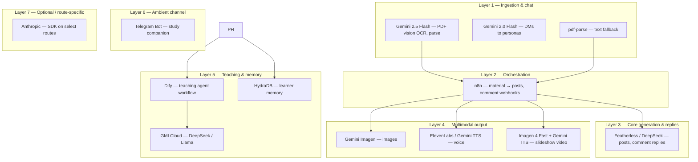

# Intentionally layered AI

The stack routes each workload to a specialized surface instead of a single “one LLM for everything” path.

**How to read it:** material enters through parsing (Layer 1); **Gemini 2.0 Flash** in the same layer handles **direct messages** to personas inside the app (a parallel path to the n8n pipeline). **n8n** (Layer 2) orchestrates material-to-posts and comment webhooks. **Featherless / DeepSeek** (Layer 3) carries most **generation and reply** work. **Imagen, TTS, and Imagen 4 Fast + Gemini TTS slideshow** (Layer 4) are **multimodal** add-ons invoked from those flows. Slideshow posts generate 3 portrait frames via Imagen 4 Fast and a spoken voiceover via Gemini TTS, capped at 2 per upload (~$0.07–0.09 each). **Dify**, **GMI Cloud**, and **HydraDB** (Layer 5) cover **teaching workflows and learner memory**. **Telegram Bot** (Layer 6) is the **messaging** surface and ties into memory and Dify. **Anthropic** (Layer 7) stays **optional**, wired only on routes that call for it.
